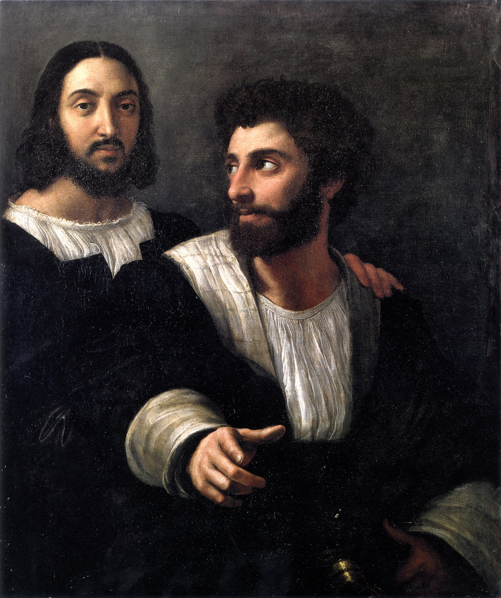

[🏠 Home](../../index.md)

# December 14

## 🧑‍🎨 Painting of the day

[Raphael](https://en.wikipedia.org/wiki/Raphael) (High Renaissance)

<button class="btn btn-success"
onclick=" window.open('https://lens.google.com/uploadbyurl?url=https://iretes.github.io/one-a-day/data/img/Raphael_7.jpg','_blank')">
Search with Google Lens
</button>

## 🎼 Song of the day

> *Get Up*
by Bob Marley and the Wailers

 Written by Bob Marley, Peter Tosh.

Released in Nov. , 1975.

<button class="btn btn-success"
onclick=" window.open('http://www.youtube.com/search?q=Get Up by Bob Marley and the Wailers','_blank')">
Search on YouTube
</button>

## 🏛️ UNESCO heritage site of the day

> *Garajonay National Park*, Spain

Laurel forest covers some 70% of this park, situated in the middle of the island of La Gomera in the Canary Islands archipelago. The presence of springs and numerous streams assures a lush vegetation resembling that of the Tertiary, which, due to climatic changes, has largely disappeared from southern Europe.

<button class="btn btn-success"
onclick=" window.open('http://www.google.com/search?q=Garajonay National Park','_blank')">
Search on Google
</button>

## 🗺️ Place of the day

<iframe
src="https://www.mapcrunch.com"
name="mapcrunch"
width="500"
height="500"
allowTransparency="true"
scrolling="no"
frameborder="0"
>
</iframe>
## 🎨 Color of the day

> *[Steel pink](https://en.wikipedia.org/wiki/Shades_of_pink#Steel_pink)*

&#9632;

## 🌿 Plant of the day

> *juneberry*

<button class="btn btn-success"
onclick=" window.open('http://www.google.com/search?q=juneberry','_blank')">
Search on Google
</button>

## 🧑‍🔬 Scientific discovery of the day

> *1884: Jacobus Henricus van 't Hoff: discovered the laws of chemical dynamics and osmotic pressure in solutions (in his work "Études de dynamique chimique").*

<button class="btn btn-success"
onclick=" window.open('http://www.google.com/search?q=1884: Jacobus Henricus van  t Hoff: discovered the laws of chemical dynamics and osmotic pressure in solutions (in his work Études de dynamique chimique).','_blank')"> 
Search on Google
</button>

## 💭 Philosophical concept of the day

> *[Yoga](https://en.wikipedia.org/wiki/Yoga)*

## 🗣️ Saying of the day

> *Zero tolerance*

A form of policing that allows no crime or anti-social behaviour to be overlooked.
