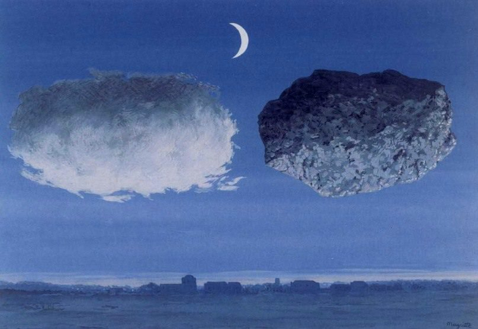

[🏠 Home](../../index.md)

# December 16

## 🧑‍🎨 Painting of the day

[Rene Magritte](http://en.wikipedia.org/wiki/René_Magritte) (Surrealism, Impressionism)

<button class="btn btn-success"
onclick=" window.open('https://lens.google.com/uploadbyurl?url=https://iretes.github.io/one-a-day/data/img/Rene_Magritte_4.jpg','_blank')">
Search with Google Lens
</button>

## 🎼 Song of the day

> *Baby I Need Your Loving*
by The Four Tops

 Written by Brian Holland, Lamont Dozier, Eddie Holland.

Released in July , 1964.

<button class="btn btn-success"
onclick=" window.open('http://www.youtube.com/search?q=Baby I Need Your Loving by The Four Tops','_blank')">
Search on YouTube
</button>

## 🏛️ UNESCO heritage site of the day

> *Rani-ki-Vav (the Queen’s Stepwell) at Patan, Gujarat*, India

Rani-ki-Vav, on the banks of the Saraswati River, was initially built as a memorial to a king in the 11th century AD. Stepwells are a distinctive form of subterranean water resource and storage systems on the Indian subcontinent, and have been constructed since the 3rd millennium BC. They evolved over time from what was basically a pit in sandy soil towards elaborate multi-storey works of art and architecture. Rani-ki-Vav was built at the height of craftsmens’ ability in stepwell construction and the Maru-Gurjara architectural style, reflecting mastery of this complex technique and great beauty of detail and proportions. Designed as an inverted temple highlighting the sanctity of water, it is divided into seven levels of stairs with sculptural panels of high artistic quality; more than 500 principle sculptures and over a thousand minor ones combine religious, mythological and secular imagery, often referencing literary works. The fourth level is the deepest and leads into a rectangular tank 9.5 m by 9.4 m, at a depth of 23 m. The well is located at the westernmost end of the property and consists of a shaft 10 m in diameter and 30 m deep.

<button class="btn btn-success"
onclick=" window.open('http://www.google.com/search?q=Rani-ki-Vav (the Queen’s Stepwell) at Patan, Gujarat','_blank')">
Search on Google
</button>

## 🗺️ Place of the day

<iframe
src="https://www.mapcrunch.com"
name="mapcrunch"
width="500"
height="500"
allowTransparency="true"
scrolling="no"
frameborder="0"
>
</iframe>
## 🎨 Color of the day

> *[Uranian blue](https://en.wikipedia.org/wiki/Shades_of_blue#Uranian_blue)*

&#9632;

## 🌿 Plant of the day

> *bow wood*

<button class="btn btn-success"
onclick=" window.open('http://www.google.com/search?q=bow wood','_blank')">
Search on Google
</button>

## 🧑‍🔬 Scientific discovery of the day

> *1846: Johann Gottfried Galle and Heinrich Louis d'Arrest: discovery of Neptune.*

<button class="btn btn-success"
onclick=" window.open('http://www.google.com/search?q=1846: Johann Gottfried Galle and Heinrich Louis d Arrest: discovery of Neptune.','_blank')">
Search on Google
</button>

## 💭 Philosophical concept of the day

> *[Motion](https://en.wikipedia.org/wiki/Motion_(physics))*

## 🗣️ Saying of the day

> *Dirt bag*

Originally a bag or sack with dirt in it. More recently an unkempt or slovenly person.
