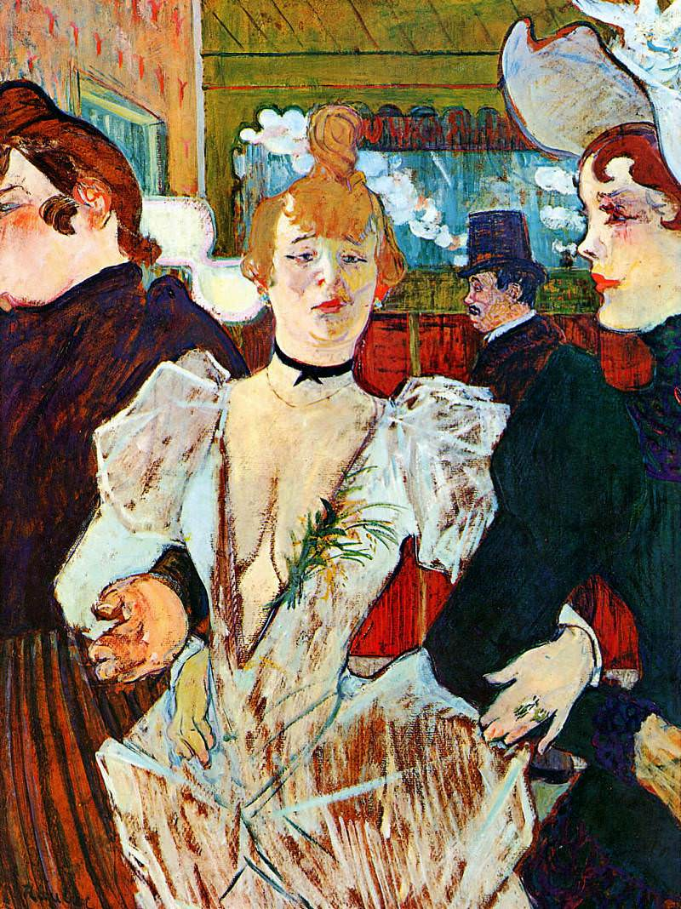

[🏠 Home](../../index.md)

# December 18

## 🧑‍🎨 Painting of the day

[Henri de Toulouse-Lautrec](https://en.wikipedia.org/wiki/Henri_de_Toulouse-Lautrec) (Post-Impressionism)

<button class="btn btn-success"
onclick=" window.open('https://lens.google.com/uploadbyurl?url=https://iretes.github.io/one-a-day/data/img/Henri_de_Toulouse-Lautrec_7.jpg','_blank')">
Search with Google Lens
</button>

## 🎼 Song of the day

> *Roxanne*
by The Police

 Written by Sting.

Released in Jan , 1979.

<button class="btn btn-success"
onclick=" window.open('http://www.youtube.com/search?q=Roxanne by The Police','_blank')">
Search on YouTube
</button>

## 🏛️ UNESCO heritage site of the day

> *At-Turaif District in ad-Dir'iyah*, Saudi Arabia

This property was the first capital of the Saudi Dynasty, in the heart of the Arabian Penisula, north-west of Riyadh. Founded in the 15th century, it bears witness to the Najdi architectural style, which is specific to the centre of the Arabian peninsula. In the 18th and early 19th century, its political and religious role increased, and the citadel at at-Turaif became the centre of the temporal power of the House of Saud and the spread of the Salafiyya reform inside the Muslim religion. The property includes the remains of many palaces and an urban ensemble built on the edge of the ad-Dir’iyah oasis.

<button class="btn btn-success"
onclick=" window.open('http://www.google.com/search?q=At-Turaif District in ad-Dir iyah','_blank')">
Search on Google
</button>

## 🗺️ Place of the day

<iframe
src="https://www.mapcrunch.com"
name="mapcrunch"
width="500"
height="500"
allowTransparency="true"
scrolling="no"
frameborder="0"
>
</iframe>
## 🎨 Color of the day

> *[Carnation pink](https://en.wikipedia.org/wiki/Carnation_pink)*

&#9632;

## 🌿 Plant of the day

> *dyers oak*

<button class="btn btn-success"
onclick=" window.open('http://www.google.com/search?q=dyers oak','_blank')">
Search on Google
</button>

## 🧑‍🔬 Scientific discovery of the day

> *1932: James Chadwick: Discovery of the neutron*

<button class="btn btn-success"
onclick=" window.open('http://www.google.com/search?q=1932: James Chadwick: Discovery of the neutron','_blank')">
Search on Google
</button>

## 💭 Philosophical concept of the day

> *[Cognitive closure](https://en.wikipedia.org/wiki/Cognitive_closure_(philosophy))*

## 🗣️ Saying of the day

> *As good luck would have it*

If something is 'as good luck would have it' it has come about by some fortunate chance.

## 🏳️‍🌈 International day

International Migrants Day, Arabic Language Day.