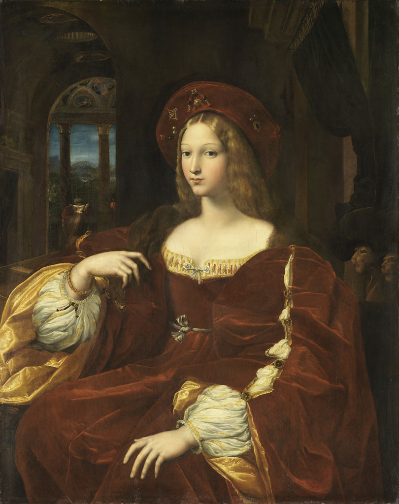

[🏠 Home](../../index.md)

# December 19

## 🧑‍🎨 Painting of the day

[Raphael](https://en.wikipedia.org/wiki/Raphael) (High Renaissance)

<button class="btn btn-success"
onclick=" window.open('https://lens.google.com/uploadbyurl?url=https://iretes.github.io/one-a-day/data/img/Raphael_5.jpg','_blank')">
Search with Google Lens
</button>

## 🎼 Song of the day

> *Tiny Dancer*
by Elton John

 Written by John, Bernie Taupin.

Released in Nov. , 1971.

<button class="btn btn-success"
onclick=" window.open('http://www.youtube.com/search?q=Tiny Dancer by Elton John','_blank')">
Search on YouTube
</button>

## 🏛️ UNESCO heritage site of the day

> *Historic Centre of Avignon: Papal Palace, Episcopal Ensemble and Avignon Bridge*, France

In the 14th century, this city in the South of France was the seat of the papacy. The Palais des Papes, an austere-looking fortress lavishly decorated by Simone Martini and Matteo Giovanetti, dominates the city, the surrounding ramparts and the remains of a 12th-century bridge over the Rhone. Beneath this outstanding example of Gothic architecture, the Petit Palais and the Romanesque Cathedral of Notre-Dame-des-Doms complete an exceptional group of monuments that testify to the leading role played by Avignon in 14th-century Christian Europe.

<button class="btn btn-success"
onclick=" window.open('http://www.google.com/search?q=Historic Centre of Avignon: Papal Palace, Episcopal Ensemble and Avignon Bridge','_blank')">
Search on Google
</button>

## 🗺️ Place of the day

<iframe
src="https://www.mapcrunch.com"
name="mapcrunch"
width="500"
height="500"
allowTransparency="true"
scrolling="no"
frameborder="0"
>
</iframe>
## 🎨 Color of the day

> *[Sand](https://en.wikipedia.org/wiki/Sand_(color))*

&#9632;

## 🌿 Plant of the day

> *flax*

<button class="btn btn-success"
onclick=" window.open('http://www.google.com/search?q=flax','_blank')">
Search on Google
</button>

## 🧑‍🔬 Scientific discovery of the day

> *2020: 3D printing had reached decent quality and affordable pricing which allowed many people to own 3D printers.*

<button class="btn btn-success"
onclick=" window.open('http://www.google.com/search?q=2020: 3D printing had reached decent quality and affordable pricing which allowed many people to own 3D printers.','_blank')">
Search on Google
</button>

## 💭 Philosophical concept of the day

> *[Idea](https://en.wikipedia.org/wiki/Idea)*

## 🗣️ Saying of the day

> *The bitter end*

To the
limit of one's efforts - to the last extremity.
