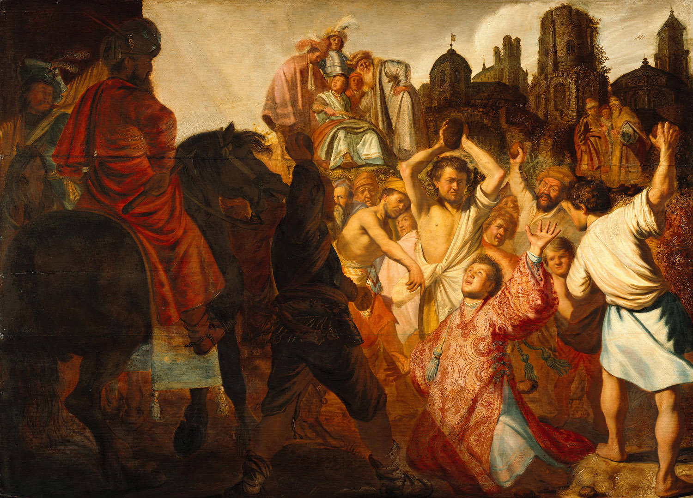

[🏠 Home](../../index.md)

# December 20

## 🧑‍🎨 Painting of the day

[Rembrandt](http://en.wikipedia.org/wiki/Rembrandt) (Baroque)

<button class="btn btn-success"
onclick=" window.open('https://lens.google.com/uploadbyurl?url=https://iretes.github.io/one-a-day/data/img/Rembrandt_1.jpg','_blank')">
Search with Google Lens
</button>

## 🎼 Song of the day

> *Know You Got Soul*
by Eric B. and Rakim

 Written by Eric B. and Rakim.

Released in July , 1987.

<button class="btn btn-success"
onclick=" window.open('http://www.youtube.com/search?q=Know You Got Soul by Eric B. and Rakim','_blank')">
Search on YouTube
</button>

## 🏛️ UNESCO heritage site of the day

> *Churches of Moldavia*, Romania

These eight churches of northern Moldavia, built from the late 15th century to the late 16th century, their external walls covered in fresco paintings, are masterpieces inspired by Byzantine art. They are authentic and particularly well preserved. Far from being mere wall decorations, the paintings form a systematic covering on all the facades and represent complete cycles of religious themes.Their exceptional composition, the elegance of the characters, and the harmony of the colors blend perfectly with the surrounding countryside. The interior and exterior walls of the Church of the Suceviţa Monastery are entirely decorated with mural paintings of the 16th century, and this church is the only one to show a representation of the ladder of St John Climacus.

<button class="btn btn-success"
onclick=" window.open('http://www.google.com/search?q=Churches of Moldavia','_blank')">
Search on Google
</button>

## 🗺️ Place of the day

<iframe
src="https://www.mapcrunch.com"
name="mapcrunch"
width="500"
height="500"
allowTransparency="true"
scrolling="no"
frameborder="0"
>
</iframe>
## 🎨 Color of the day

> *[Turtle green](https://en.wikipedia.org/wiki/Shades_of_chartreuse#Turtle_green)*

&#9632;

## 🌿 Plant of the day

> *yellow daisy*

<button class="btn btn-success"
onclick=" window.open('http://www.google.com/search?q=yellow daisy','_blank')">
Search on Google
</button>

## 🧑‍🔬 Scientific discovery of the day

> *600 BC - 200 BC: The Sushruta Samhita shows an understanding of musculoskeletal structure (including joints, ligaments and muscles and their functions) (3.V). It refers to the cardiovascular system as a closed circuit. In (3.IX) it identifies the existence of nerves.*

<button class="btn btn-success"
onclick=" window.open('http://www.google.com/search?q=600 BC - 200 BC: The Sushruta Samhita shows an understanding of musculoskeletal structure (including joints, ligaments and muscles and their functions) (3.V). It refers to the cardiovascular system as a closed circuit. In (3.IX) it identifies the existence of nerves.','_blank')">
Search on Google
</button>

## 💭 Philosophical concept of the day

> *[Body without organs](https://en.wikipedia.org/wiki/Body_without_organs)*

## 🗣️ Saying of the day

> *Procrastination is the thief of time*

Putting off an action leads to time wasting. If something is necessary, it is best to act quickly to accomplish it.

## 🏳️‍🌈 International day

International Human Solidarity Day.