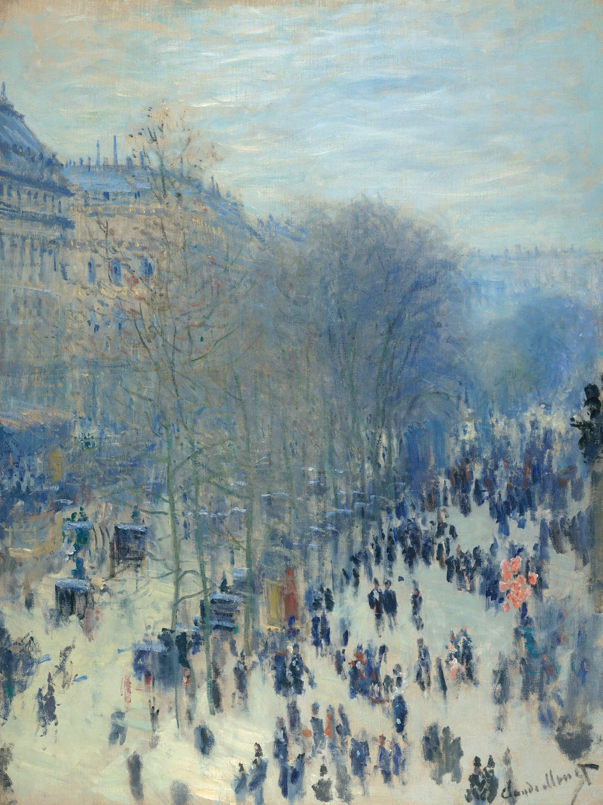

[🏠 Home](../../index.md)

# December 21

## 🧑‍🎨 Painting of the day

[Claude Monet](http://en.wikipedia.org/wiki/Claude_Monet) (Impressionism)

<button class="btn btn-success"
onclick=" window.open('https://lens.google.com/uploadbyurl?url=https://iretes.github.io/one-a-day/data/img/Claude_Monet_7.jpg','_blank')">
Search with Google Lens
</button>

## 🎼 Song of the day

> *Stills*
by Crosby

 Written by Neil Young.

Released in June , 1970.

<button class="btn btn-success"
onclick=" window.open('http://www.youtube.com/search?q=Stills by Crosby','_blank')">
Search on YouTube
</button>

## 🏛️ UNESCO heritage site of the day

> *Historic Centre of Rome, the Properties of the Holy See in that City Enjoying Extraterritorial Rights and San Paolo Fuori le Mura*, Holy See,Italy

Founded, according to legend, by Romulus and Remus in 753 BC, Rome was first the centre of the Roman Republic, then of the Roman Empire, and it became the capital of the Christian world in the 4th century. The World Heritage site, extended in 1990 to the walls of Urban VIII, includes some of the major monuments of antiquity such as the Forums, the Mausoleum of Augustus, the Mausoleum of Hadrian, the Pantheon, Trajan’s Column and the Column of Marcus Aurelius, as well as the religious and public buildings of papal Rome.

<button class="btn btn-success"
onclick=" window.open('http://www.google.com/search?q=Historic Centre of Rome, the Properties of the Holy See in that City Enjoying Extraterritorial Rights and San Paolo Fuori le Mura','_blank')">
Search on Google
</button>

## 🗺️ Place of the day

<iframe
src="https://www.mapcrunch.com"
name="mapcrunch"
width="500"
height="500"
allowTransparency="true"
scrolling="no"
frameborder="0"
>
</iframe>
## 🎨 Color of the day

> *[Radical Red](https://en.wikipedia.org/wiki/Amaranth_(color)#Radical_red_(bright_amaranth_pink))*

&#9632;

## 🌿 Plant of the day

> *american nightshade*

<button class="btn btn-success"
onclick=" window.open('http://www.google.com/search?q=american nightshade','_blank')">
Search on Google
</button>

## 🧑‍🔬 Scientific discovery of the day

> *1898: J.J. Thomson proposed the plum pudding model of an atom*

<button class="btn btn-success"
onclick=" window.open('http://www.google.com/search?q=1898: J.J. Thomson proposed the plum pudding model of an atom','_blank')"> 
Search on Google
</button>

## 💭 Philosophical concept of the day

> *[Contingency](https://en.wikipedia.org/wiki/Contingency_(philosophy))*

## 🗣️ Saying of the day

> *Plague on both your houses - A *

A frustrated
 curse on both sides of an argument.

## 🏳️‍🌈 International day

World Basketball Day.