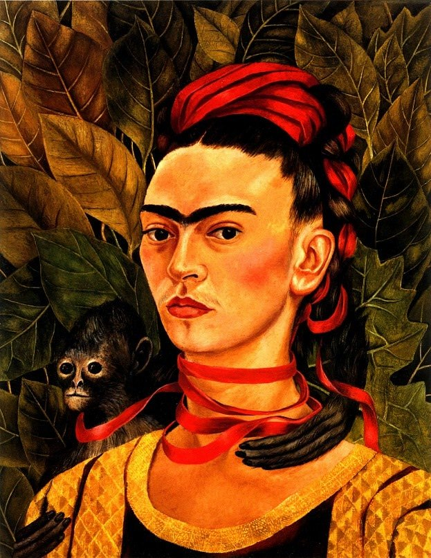

[🏠 Home](../../index.md)

# December 22

## 🧑‍🎨 Painting of the day

[Frida Kahlo](http://en.wikipedia.org/wiki/Frida_Kahlo) (Primitivism, Surrealism)

<button class="btn btn-success"
onclick=" window.open('https://lens.google.com/uploadbyurl?url=https://iretes.github.io/one-a-day/data/img/Frida_Kahlo_3.jpg','_blank')">
Search with Google Lens
</button>

## 🎼 Song of the day

> *Ticket to Ride*
by The Beatles

 Written by John Lennon, Paul McCartney.

Released in April , 1965.

<button class="btn btn-success"
onclick=" window.open('http://www.youtube.com/search?q=Ticket to Ride by The Beatles','_blank')">
Search on YouTube
</button>

## 🏛️ UNESCO heritage site of the day

> *Historic Centre of Guimarães*, Portugal

The historic town of Guimarães is associated with the emergence of the Portuguese national identity in the 12th century. An exceptionally well-preserved and authentic example of the evolution of a medieval settlement into a modern town, its rich building typology exemplifies the specific development of Portuguese architecture from the 15th to 19th century through the consistent use of traditional building materials and techniques.

<button class="btn btn-success"
onclick=" window.open('http://www.google.com/search?q=Historic Centre of Guimarães','_blank')">
Search on Google
</button>

## 🗺️ Place of the day

<iframe
src="https://www.mapcrunch.com"
name="mapcrunch"
width="500"
height="500"
allowTransparency="true"
scrolling="no"
frameborder="0"
>
</iframe>
## 🎨 Color of the day

> *[Old silver](https://en.wikipedia.org/wiki/Silver_(color)#Old_silver)*

&#9632;

## 🌿 Plant of the day

> *hay fever weed*

<button class="btn btn-success"
onclick=" window.open('http://www.google.com/search?q=hay fever weed','_blank')">
Search on Google
</button>

## 🧑‍🔬 Scientific discovery of the day

> *100: Menelaus of Alexandria describes spherical triangles, a precursor to non-Euclidean geometry.*

<button class="btn btn-success"
onclick=" window.open('http://www.google.com/search?q=100: Menelaus of Alexandria describes spherical triangles, a precursor to non-Euclidean geometry.','_blank')"> 
Search on Google
</button>

## 💭 Philosophical concept of the day

> *[Wrong](https://en.wikipedia.org/wiki/Wrong)*

## 🗣️ Saying of the day

> *Golden key can open any door - A *

'A golden key opens any door' is the opinion that sufficient money, or the promise of it, will allow the possessor of it to do anything they wish.
