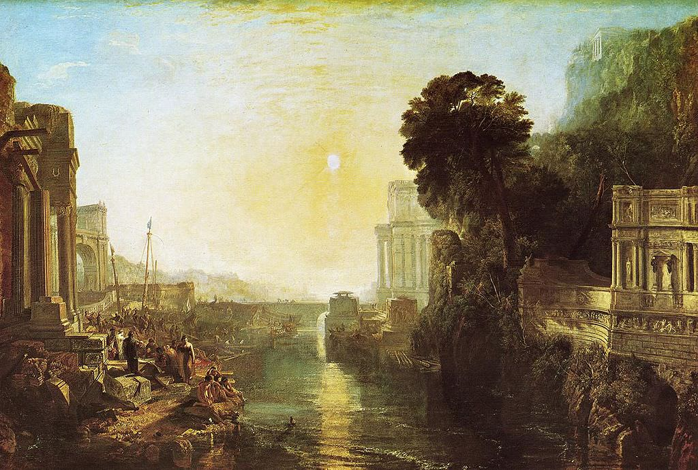

[🏠 Home](../../index.md)

# December 23

## 🧑‍🎨 Painting of the day

[William Turner](https://en.wikipedia.org/wiki/J._M._W._Turner) (Romanticism)

<button class="btn btn-success"
onclick=" window.open('https://lens.google.com/uploadbyurl?url=https://iretes.github.io/one-a-day/data/img/William_Turner_6.jpg','_blank')">
Search with Google Lens
</button>

## 🎼 Song of the day

> *Whipping Post*
by The Allman Brothers Band

 Written by Gregg Allman.

Released in Nov. , 1969.

<button class="btn btn-success"
onclick=" window.open('http://www.youtube.com/search?q=Whipping Post by The Allman Brothers Band','_blank')">
Search on YouTube
</button>

## 🏛️ UNESCO heritage site of the day

> *Central Suriname Nature Reserve*, Suriname

The Central Suriname Nature Reserve comprises 1.6 million ha of primary tropical forest of west-central Suriname. It protects the upper watershed of the Coppename River and the headwaters of the Lucie, Oost, Zuid, Saramaccz, and Gran Rio rivers and covers a range of topography and ecosystems of notable conservation value due to its pristine state. Its montane and lowland forests contain a high diversity of plant life with more than 5,000 vascular plant species collected to date. The Reserve's animals are typical of the region and include the jaguar, giant armadillo, giant river otter, tapir, sloths, eight species of primates and 400 bird species such as harpy eagle, Guiana cock-of-the-rock, and scarlet macaw.

<button class="btn btn-success"
onclick=" window.open('http://www.google.com/search?q=Central Suriname Nature Reserve','_blank')">
Search on Google
</button>

## 🗺️ Place of the day

<iframe
src="https://www.mapcrunch.com"
name="mapcrunch"
width="500"
height="500"
allowTransparency="true"
scrolling="no"
frameborder="0"
>
</iframe>
## 🎨 Color of the day

> *[Iceberg](https://en.wikipedia.org/wiki/Blue-gray#Iceberg)*

&#9632;

## 🌿 Plant of the day

> *moose maple*

<button class="btn btn-success"
onclick=" window.open('http://www.google.com/search?q=moose maple','_blank')">
Search on Google
</button>

## 🧑‍🔬 Scientific discovery of the day

> *1887: Albert A. Michelson and Edward W. Morley: Michelson–Morley experiment which showed a lack of evidence for the aether.*

<button class="btn btn-success"
onclick=" window.open('http://www.google.com/search?q=1887: Albert A. Michelson and Edward W. Morley: Michelson–Morley experiment which showed a lack of evidence for the aether.','_blank')"> 
Search on Google
</button>

## 💭 Philosophical concept of the day

> *[Philosophical zombie](https://en.wikipedia.org/wiki/Philosophical_zombie)*

## 🗣️ Saying of the day

> *Living daylights*

To beat the living daylights out of someone is to beat them severely, to the point where they lose consciousness. 
