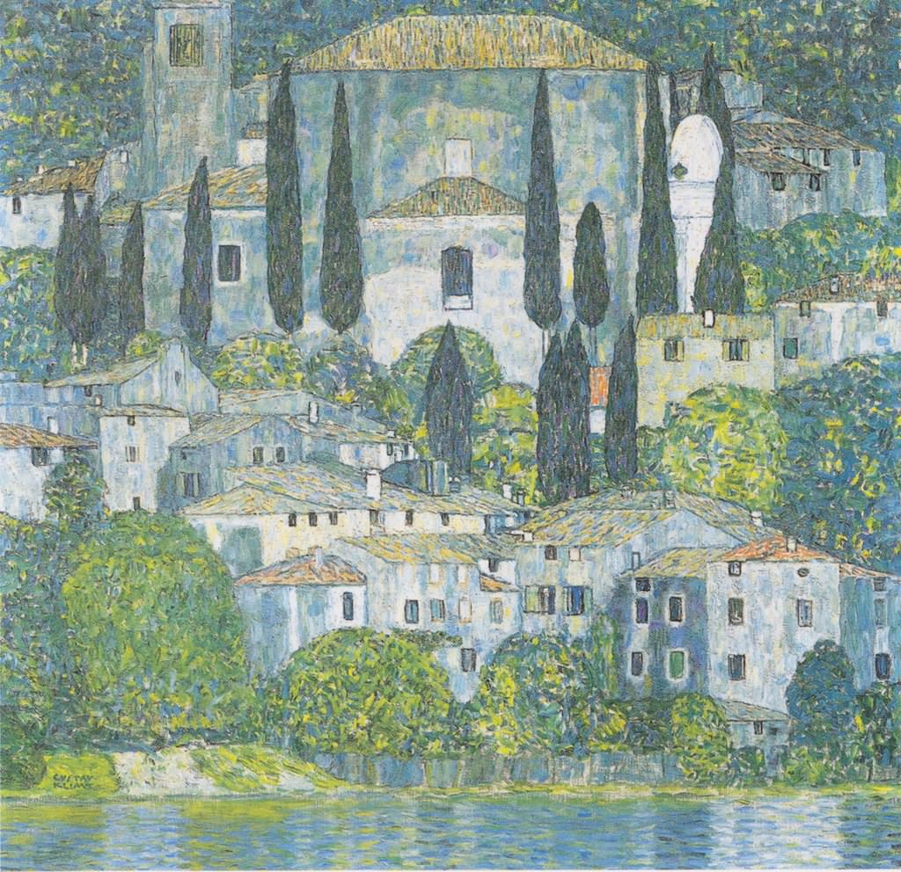

[🏠 Home](../../index.md)

# December 24

## 🧑‍🎨 Painting of the day

[Gustav Klimt](http://en.wikipedia.org/wiki/Gustav_Klimt) (Symbolism, Art Nouveau)

<button class="btn btn-success"
onclick=" window.open('https://lens.google.com/uploadbyurl?url=https://iretes.github.io/one-a-day/data/img/Gustav_Klimt_2.jpg','_blank')">
Search with Google Lens
</button>

## 🎼 Song of the day

> *Bitter Sweet Symphony*
by The Verve

 Written by Mick Jagger, Keith Richards, Richard Ashcroft.

Released in Sept. , 1997.

<button class="btn btn-success"
onclick=" window.open('http://www.youtube.com/search?q=Bitter Sweet Symphony by The Verve','_blank')">
Search on YouTube
</button>

## 🏛️ UNESCO heritage site of the day

> *Singapore Botanic Gardens*, Singapore

Situated at the heart of the city of Singapore, the site demonstrates the evolution of a British tropical colonial botanic garden that has become a modern world-class scientific institution used for both conservation and education. The cultural landscape includes a rich variety of historic features, plantings and buildings that demonstrate the development of the garden since its creation in 1859. It has been an important centre for science, research and plant conservation, notably in connection with the cultivation of rubber plantations, in Southeast Asia since 1875.

<button class="btn btn-success"
onclick=" window.open('http://www.google.com/search?q=Singapore Botanic Gardens','_blank')">
Search on Google
</button>

## 🗺️ Place of the day

<iframe
src="https://www.mapcrunch.com"
name="mapcrunch"
width="500"
height="500"
allowTransparency="true"
scrolling="no"
frameborder="0"
>
</iframe>
## 🎨 Color of the day

> *[Straw](https://en.wikipedia.org/wiki/Straw_(colour))*

&#9632;

## 🌿 Plant of the day

> *dames gilli flower*

<button class="btn btn-success"
onclick=" window.open('http://www.google.com/search?q=dames gilli flower','_blank')">
Search on Google
</button>

## 🧑‍🔬 Scientific discovery of the day

> *2020: Space company SpaceX sent two NASA astronauts to the International Space Station on 30 May 2020, marking the first time a private company completed a crewed orbital spaceflight mission.*

<button class="btn btn-success"
onclick=" window.open('http://www.google.com/search?q=2020: Space company SpaceX sent two NASA astronauts to the International Space Station on 30 May 2020, marking the first time a private company completed a crewed orbital spaceflight mission.','_blank')"> 
Search on Google
</button>

## 💭 Philosophical concept of the day

> *[Self](https://en.wikipedia.org/wiki/Self_(philosophy))*

## 🗣️ Saying of the day

> *A bird in the hand is worth two in the bush*

The proverb 'A bird in the hand is worth two in the bush' means  that it's
          better to hold onto something you  have rather than take the risk of getting something better  which may come to nothing.
