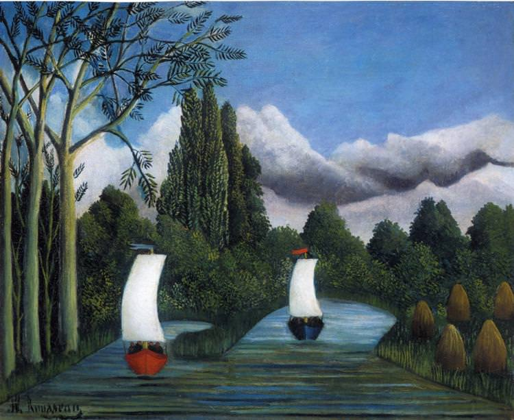

[🏠 Home](../../index.md)

# December 25

## 🧑‍🎨 Painting of the day

[Henri Rousseau](https://en.wikipedia.org/wiki/Henri_Rousseau) (Primitivism)

<button class="btn btn-success"
onclick=" window.open('https://lens.google.com/uploadbyurl?url=https://iretes.github.io/one-a-day/data/img/Henri_Rousseau_5.jpg','_blank')">
Search with Google Lens
</button>

## 🎼 Song of the day

> *Tell It Like It Is*
by Aaron Neville

 Written by George Davis, Lee Diamond.

Released in Nov. , 1966.

<button class="btn btn-success"
onclick=" window.open('http://www.youtube.com/search?q=Tell It Like It Is by Aaron Neville','_blank')">
Search on YouTube
</button>

## 🏛️ UNESCO heritage site of the day

> *Temple of Apollo Epicurius at Bassae*, Greece

This famous temple to the god of healing and the sun was built towards the middle of the 5th century B.C. in the lonely heights of the Arcadian mountains. The temple, which has the oldest Corinthian capital yet found, combines the Archaic style and the serenity of the Doric style with some daring architectural features.

<button class="btn btn-success"
onclick=" window.open('http://www.google.com/search?q=Temple of Apollo Epicurius at Bassae','_blank')">
Search on Google
</button>

## 🗺️ Place of the day

<iframe
src="https://www.mapcrunch.com"
name="mapcrunch"
width="500"
height="500"
allowTransparency="true"
scrolling="no"
frameborder="0"
>
</iframe>
## 🎨 Color of the day

> *[Blue sapphire](https://en.wikipedia.org/wiki/Sapphire_(color)#Blue_sapphire)*

&#9632;

## 🌿 Plant of the day

> *european weeping birch*

<button class="btn btn-success"
onclick=" window.open('http://www.google.com/search?q=european weeping birch','_blank')">
Search on Google
</button>

## 🧑‍🔬 Scientific discovery of the day

> *1900: Max Planck: explains the emission spectrum of a black body*

<button class="btn btn-success"
onclick=" window.open('http://www.google.com/search?q=1900: Max Planck: explains the emission spectrum of a black body','_blank')"> 
Search on Google
</button>

## 💭 Philosophical concept of the day

> *[Descriptive knowledge](https://en.wikipedia.org/wiki/Descriptive_knowledge)*

## 🗣️ Saying of the day

> *Go out on a limb*

Put oneself in an isolated  position in one's support of someone or something.
