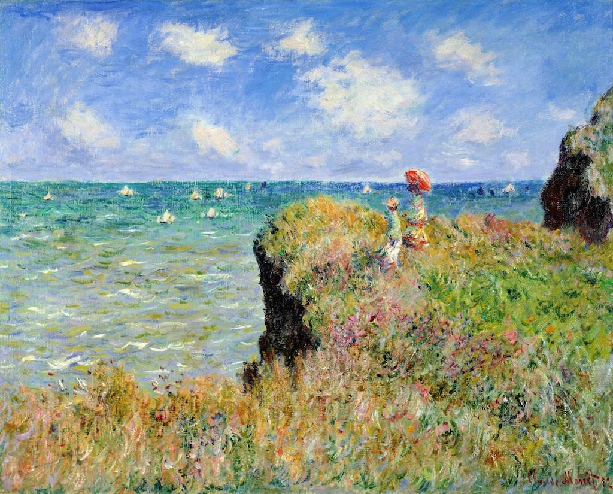

[🏠 Home](../../index.md)

# December 27

## 🧑‍🎨 Painting of the day

[Claude Monet](http://en.wikipedia.org/wiki/Claude_Monet) (Impressionism)

<button class="btn btn-success"
onclick=" window.open('https://lens.google.com/uploadbyurl?url=https://iretes.github.io/one-a-day/data/img/Claude_Monet_5.jpg','_blank')">
Search with Google Lens
</button>

## 🎼 Song of the day

> *Radio Free Europe*
by R.E.M.

 Written by R.E.M..

Released in July , 1983.

<button class="btn btn-success"
onclick=" window.open('http://www.youtube.com/search?q=Radio Free Europe by R.E.M.','_blank')">
Search on YouTube
</button>

## 🏛️ UNESCO heritage site of the day

> *The Porticoes of Bologna*, Italy

The serial property comprises twelve component parts consisting of ensembles of porticoes and their surrounding built areas, located within the Municipality of Bologna from the 12th century to the present. These portico ensembles are considered to be the most representative among city’s porticoes, which cover a total stretch of 62 km. Some of the porticoes are built of wood, others of stone or brick, as well as reinforced concrete, covering roads, squares, paths and walkways, either on one or both sides of a street. The property includes porticoed buildings that do not form a structural continuum with other buildings and therefore are not part of a comprehensive covered walkway or passage. The porticoes are appreciated as sheltered walkways and prime locations for merchant activities. In the 20th century, the use of concrete allowed the replacement of the traditional vaulted arcades with new building possibilities and a new architectural language for the porticoes emerged, as exemplified in the Barca district. Together, the selected porticoes reflect different typologies, urban and social functions and chronological phases. Defined as private property for public use, the porticoes have become an expression and element of Bologna’s urban identity. 

<button class="btn btn-success"
onclick=" window.open('http://www.google.com/search?q=The Porticoes of Bologna','_blank')">
Search on Google
</button>

## 🗺️ Place of the day

<iframe
src="https://www.mapcrunch.com"
name="mapcrunch"
width="500"
height="500"
allowTransparency="true"
scrolling="no"
frameborder="0"
>
</iframe>
## 🎨 Color of the day

> *[Beau blue](https://en.wikipedia.org/wiki/Baby_blue#Beau_blue)*

&#9632;

## 🌿 Plant of the day

> *hellebore*

<button class="btn btn-success"
onclick=" window.open('http://www.google.com/search?q=hellebore','_blank')">
Search on Google
</button>

## 🧑‍🔬 Scientific discovery of the day

> *1543: Vesalius: pioneering research into human anatomy.*

<button class="btn btn-success"
onclick=" window.open('http://www.google.com/search?q=1543: Vesalius: pioneering research into human anatomy.','_blank')"> 
Search on Google
</button>

## 💭 Philosophical concept of the day

> *[Aesthetic interpretation](https://en.wikipedia.org/wiki/Aesthetic_interpretation)*

## 🗣️ Saying of the day

> *Air kiss*

The act of greeting (or sometimes of farewell) by making a kissing gesture into the air while brushing cheeks - or in a near miss. 

## 🏳️‍🌈 International day

International Day of Epidemic Preparedness.