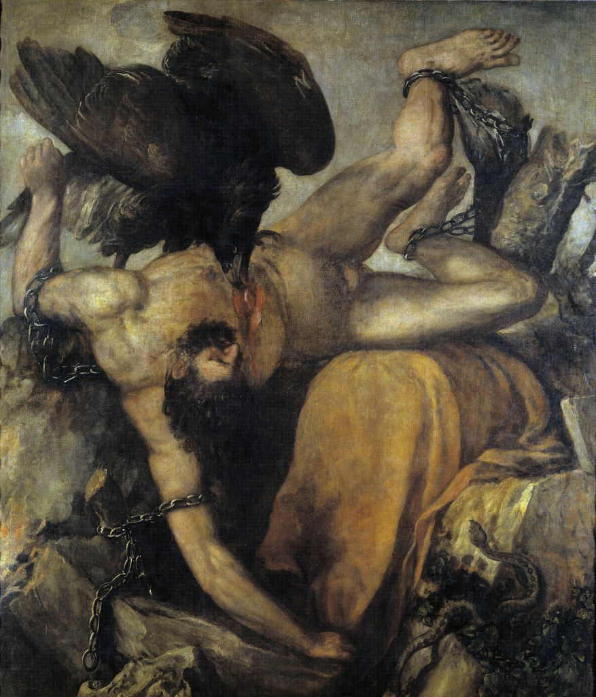

[🏠 Home](../../index.md)

# December 29

## 🧑‍🎨 Painting of the day

[Titian](http://en.wikipedia.org/wiki/Titian) (High Renaissance, Mannerism)

<button class="btn btn-success"
onclick=" window.open('https://lens.google.com/uploadbyurl?url=https://iretes.github.io/one-a-day/data/img/Titian_2.jpg','_blank')">
Search with Google Lens
</button>

## 🎼 Song of the day

> *Hit the Road Jack*
by Ray Charles

 Written by Percy Mayfield.

Released in Sept. , 1961.

<button class="btn btn-success"
onclick=" window.open('http://www.youtube.com/search?q=Hit the Road Jack by Ray Charles','_blank')">
Search on YouTube
</button>

## 🏛️ UNESCO heritage site of the day

> *Stari Grad Plain*, Croatia

Stari Grad Plain on the Adriatic island of Hvar is a cultural landscape that has remained practically intact since it was first colonized by Ionian Greeks from Paros in the 4th century BC. The original agricultural activity of this fertile plain, mainly centring on grapes and olives, has been maintained since Greek times to the present. The site is also a natural reserve. The landscape features ancient stone walls and trims, or small stone shelters, and bears testimony to the ancient geometrical system of land division used by the ancient Greeks, the chora which has remained virtually intact over 24 centuries.

<button class="btn btn-success"
onclick=" window.open('http://www.google.com/search?q=Stari Grad Plain','_blank')">
Search on Google
</button>

## 🗺️ Place of the day

<iframe
src="https://www.mapcrunch.com"
name="mapcrunch"
width="500"
height="500"
allowTransparency="true"
scrolling="no"
frameborder="0"
>
</iframe>
## 🎨 Color of the day

> *[Xanthous](https://en.wikipedia.org/wiki/Shades_of_yellow#Xanthous)*

&#9632;

## 🌿 Plant of the day

> *yellow harlequin*

<button class="btn btn-success"
onclick=" window.open('http://www.google.com/search?q=yellow harlequin','_blank')">
Search on Google
</button>

## 🧑‍🔬 Scientific discovery of the day

> *975: Halayudha organizes the binomial coefficients into a triangle, i.e. Pascal's triangle.*

<button class="btn btn-success"
onclick=" window.open('http://www.google.com/search?q=975: Halayudha organizes the binomial coefficients into a triangle, i.e. Pascal s triangle.','_blank')"> 
Search on Google
</button>

## 💭 Philosophical concept of the day

> *[Sublime](https://en.wikipedia.org/wiki/Sublime_(philosophy))*

## 🗣️ Saying of the day

> *Chaise lounge*

A 'chaise lounge' is the American name of a form of sofa with a backrest at one end only. Elsewhere these sofas are called chaise longues.
