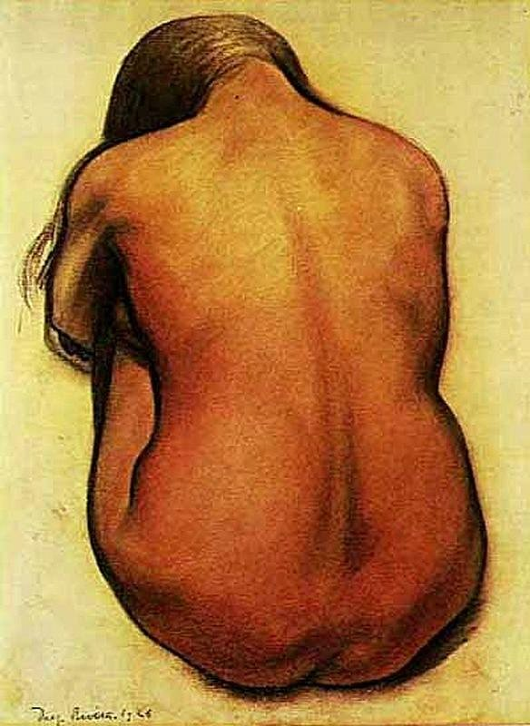

[🏠 Home](../../index.md)

# December 3

## 🧑‍🎨 Painting of the day

[Diego Rivera](http://en.wikipedia.org/wiki/Diego_Rivera) (Social Realism, Muralism)

<button class="btn btn-success"
onclick=" window.open('https://lens.google.com/uploadbyurl?url=https://iretes.github.io/one-a-day/data/img/Diego_Rivera_6.jpg','_blank')">
Search with Google Lens
</button>

## 🎼 Song of the day

> *Thats Entertainment*
by The Jam

 Written by Paul Weller.

Released in Nov. , 1980.

<button class="btn btn-success"
onclick=" window.open('http://www.youtube.com/search?q=Thats Entertainment by The Jam','_blank')">
Search on YouTube
</button>

## 🏛️ UNESCO heritage site of the day

> *Archaeological Site of Leptis Magna*, Libya

Leptis Magna was enlarged and embellished by Septimius Severus, who was born there and later became emperor. It was one of the most beautiful cities of the Roman Empire, with its imposing public monuments, harbour, market-place, storehouses, shops and residential districts.

<button class="btn btn-success"
onclick=" window.open('http://www.google.com/search?q=Archaeological Site of Leptis Magna','_blank')">
Search on Google
</button>

## 🗺️ Place of the day

<iframe
src="https://www.mapcrunch.com"
name="mapcrunch"
width="500"
height="500"
allowTransparency="true"
scrolling="no"
frameborder="0"
>
</iframe>
## 🎨 Color of the day

> *[Green Lizard](https://en.wikipedia.org/wiki/List_of_Crayola_crayon_colors#Heads_&#39;n_Tails)*

&#9632;

## 🌿 Plant of the day

> *blue ash*

<button class="btn btn-success"
onclick=" window.open('http://www.google.com/search?q=blue ash','_blank')">
Search on Google
</button>

## 🧑‍🔬 Scientific discovery of the day

> *3rd century BC: Eratosthenes measures the circumference of the Earth.*

<button class="btn btn-success"
onclick=" window.open('http://www.google.com/search?q=3rd century BC: Eratosthenes measures the circumference of the Earth.','_blank')"> 
Search on Google
</button>

## 💭 Philosophical concept of the day

> *[Kaula](https://en.wikipedia.org/wiki/Kaula_(Hinduism))*

## 🗣️ Saying of the day

> *Giddy aunt*

An exclamation of surprise. 

## 🏳️‍🌈 International day

International Day of Persons with Disabilities.