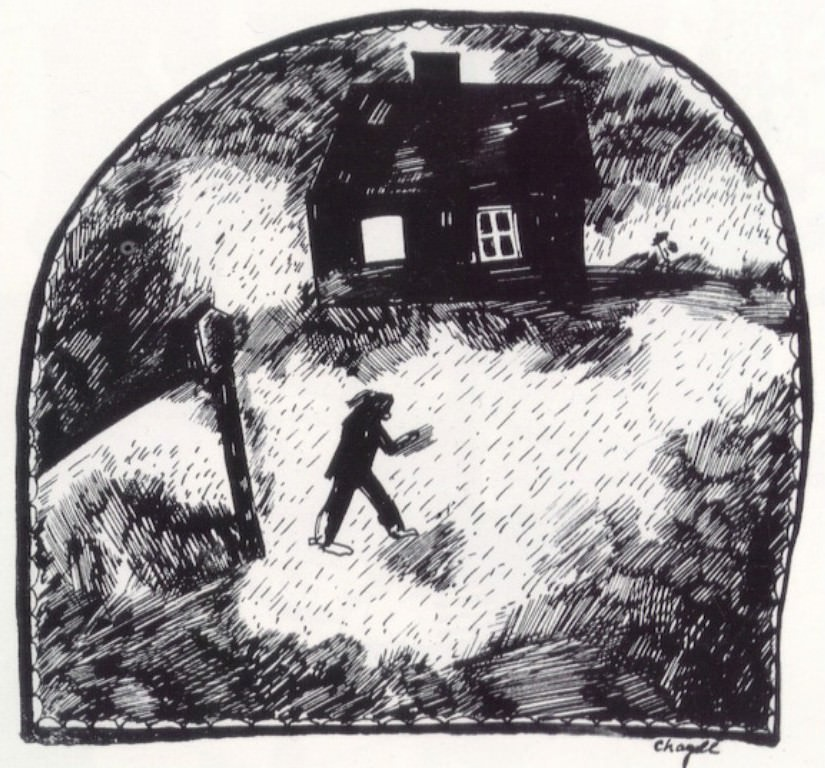

[🏠 Home](../../index.md)

# December 30

## 🧑‍🎨 Painting of the day

[Marc Chagall](http://en.wikipedia.org/wiki/Marc_Chagall) (Primitivism)

<button class="btn btn-success"
onclick=" window.open('https://lens.google.com/uploadbyurl?url=https://iretes.github.io/one-a-day/data/img/Marc_Chagall_6.jpg','_blank')">
Search with Google Lens
</button>

## 🎼 Song of the day

> *Maps*
by Yeah Yeah Yeahs

 Written by Yeah Yeah Yeahs.

Released in Feb. , 2004.

<button class="btn btn-success"
onclick=" window.open('http://www.youtube.com/search?q=Maps by Yeah Yeah Yeahs','_blank')">
Search on YouTube
</button>

## 🏛️ UNESCO heritage site of the day

> *Old Town of Lijiang*, China

The Old Town of Lijiang, which is perfectly adapted to the uneven topography of this key commercial and strategic site, has retained a historic townscape of high quality and authenticity. Its architecture is noteworthy for the blending of elements from several cultures that have come together over many centuries. Lijiang also possesses an ancient water-supply system of great complexity and ingenuity that still functions effectively today.

<button class="btn btn-success"
onclick=" window.open('http://www.google.com/search?q=Old Town of Lijiang','_blank')">
Search on Google
</button>

## 🗺️ Place of the day

<iframe
src="https://www.mapcrunch.com"
name="mapcrunch"
width="500"
height="500"
allowTransparency="true"
scrolling="no"
frameborder="0"
>
</iframe>
## 🎨 Color of the day

> *[Fandango pink](https://en.wikipedia.org/wiki/Shades_of_pink#Fandango_pink)*

&#9632;

## 🌿 Plant of the day

> *kudzu*

<button class="btn btn-success"
onclick=" window.open('http://www.google.com/search?q=kudzu','_blank')">
Search on Google
</button>

## 🧑‍🔬 Scientific discovery of the day

> *1620: Appearance of the first compound microscopes in Europe.*

<button class="btn btn-success"
onclick=" window.open('http://www.google.com/search?q=1620: Appearance of the first compound microscopes in Europe.','_blank')"> 
Search on Google
</button>

## 💭 Philosophical concept of the day

> *[Free will](https://en.wikipedia.org/wiki/Free_will)*

## 🗣️ Saying of the day

> *The year dot*

A very long time ago; too long ago to be dated.
