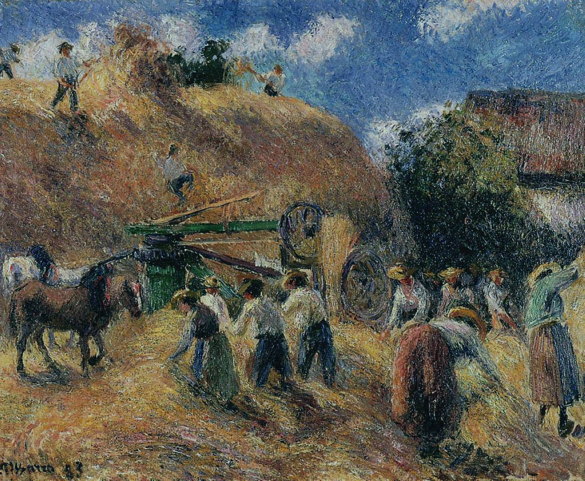

[🏠 Home](../../index.md)

# December 31

## 🧑‍🎨 Painting of the day

[Camille Pissarro](https://en.wikipedia.org/wiki/Camille_Pissarro) (Impressionism, Post-Impressionism)

<button class="btn btn-success"
onclick=" window.open('https://lens.google.com/uploadbyurl?url=https://iretes.github.io/one-a-day/data/img/Camille_Pissarro_6.jpg','_blank')">
Search with Google Lens
</button>

## 🎼 Song of the day

> *Fake Plastic Trees*
by Radiohead

 Written by Radiohead.

Released in March , 1995.

<button class="btn btn-success"
onclick=" window.open('http://www.youtube.com/search?q=Fake Plastic Trees by Radiohead','_blank')">
Search on YouTube
</button>

## 🏛️ UNESCO heritage site of the day

> *Þingvellir National Park*, Iceland

Þingvellir (Thingvellir) is the National Park where the Althing, an open-air assembly representing the whole of Iceland, was established in 930 and continued to meet until 1798. Over two weeks a year, the assembly set laws - seen as a covenant between free men - and settled disputes. The Althing has deep historical and symbolic associations for the people of Iceland. The property includes the Þingvellir National Park and the remains of the Althing itself: fragments of around 50 booths built from turf and stone. Remains from the 10th century are thought to be buried underground. The site also includes remains of agricultural use from the 18th and 19th centuries. The park shows evidence of the way the landscape was husbanded over 1,000 years.

<button class="btn btn-success"
onclick=" window.open('http://www.google.com/search?q=Þingvellir National Park','_blank')">
Search on Google
</button>

## 🗺️ Place of the day

<iframe
src="https://www.mapcrunch.com"
name="mapcrunch"
width="500"
height="500"
allowTransparency="true"
scrolling="no"
frameborder="0"
>
</iframe>
## 🎨 Color of the day

> *[Lavender (web)](https://en.wikipedia.org/wiki/Lavender_(color))*

&#9632;

## 🌿 Plant of the day

> *oxford ragwort*

<button class="btn btn-success"
onclick=" window.open('http://www.google.com/search?q=oxford ragwort','_blank')">
Search on Google
</button>

## 🧑‍🔬 Scientific discovery of the day

> *1895: Wilhelm Conrad Röntgen discovers x-rays.*

<button class="btn btn-success"
onclick=" window.open('http://www.google.com/search?q=1895: Wilhelm Conrad Röntgen discovers x-rays.','_blank')">
Search on Google
</button>

## 💭 Philosophical concept of the day

> *[Efficient cause](https://en.wikipedia.org/wiki/Efficient_cause)*

## 🗣️ Saying of the day

> *Back to the drawing board*

Start again on a new design  or plan after the  failure of an earlier attempt.
