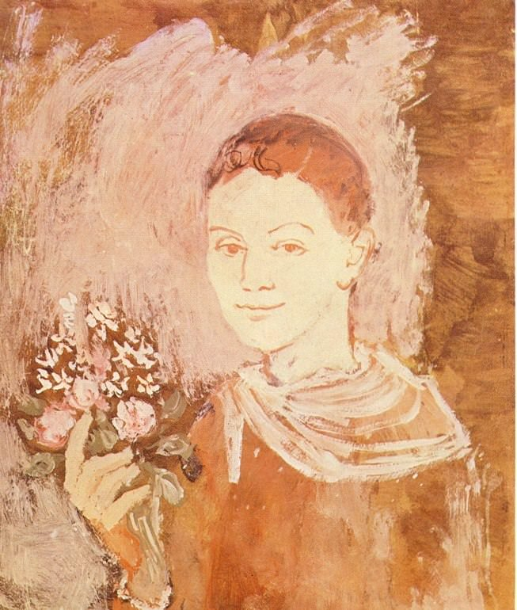

[🏠 Home](../../index.md)

# December 4

## 🧑‍🎨 Painting of the day

[Pablo Picasso](http://en.wikipedia.org/wiki/Pablo_Picasso) (Cubism)

<button class="btn btn-success"
onclick=" window.open('https://lens.google.com/uploadbyurl?url=https://iretes.github.io/one-a-day/data/img/Pablo_Picasso_5.jpg','_blank')">
Search with Google Lens
</button>

## 🎼 Song of the day

> *Say It Loud - Im Black and Im Proud*
by James Brown

 Written by Brown, Pee Wee Ellis.

Released in Sept. , 1968.

<button class="btn btn-success"
onclick=" window.open('http://www.youtube.com/search?q=Say It Loud - Im Black and Im Proud by James Brown','_blank')">
Search on YouTube
</button>

## 🏛️ UNESCO heritage site of the day

> *Miguasha National Park*, Canada

The palaeontological site of Miguasha National Park, in south-eastern Quebec on the southern coast of the Gaspé peninsula, is considered to be the world's most outstanding illustration of the Devonian Period known as the 'Age of Fishes'. Dating from 370 million years ago, the Upper Devonian Escuminac Formation represented here contains five of the six fossil fish groups associated with this period. Its significance stems from the discovery there of the highest number and best-preserved fossil specimens of the lobe-finned fishes that gave rise to the first four-legged, air-breathing terrestrial vertebrates – the tetrapods.

<button class="btn btn-success"
onclick=" window.open('http://www.google.com/search?q=Miguasha National Park','_blank')">
Search on Google
</button>

## 🗺️ Place of the day

<iframe
src="https://www.mapcrunch.com"
name="mapcrunch"
width="500"
height="500"
allowTransparency="true"
scrolling="no"
frameborder="0"
>
</iframe>
## 🎨 Color of the day

> *[Black olive](https://en.wikipedia.org/wiki/Olive_(color)#Black_olive)*

&#9632;

## 🌿 Plant of the day

> *western trillium*

<button class="btn btn-success"
onclick=" window.open('http://www.google.com/search?q=western trillium','_blank')">
Search on Google
</button>

## 🧑‍🔬 Scientific discovery of the day

> *11th century: Shen Kuo discovers atmospheric refraction and provides the correct explanation of rainbow phenomenon.*

<button class="btn btn-success"
onclick=" window.open('http://www.google.com/search?q=11th century: Shen Kuo discovers atmospheric refraction and provides the correct explanation of rainbow phenomenon.','_blank')"> 
Search on Google
</button>

## 💭 Philosophical concept of the day

> *[Intention](https://en.wikipedia.org/wiki/Intention)*

## 🗣️ Saying of the day

> *The pen is mightier than the sword *

Literal meaning.

## 🏳️‍🌈 International day

International Day of Banks".