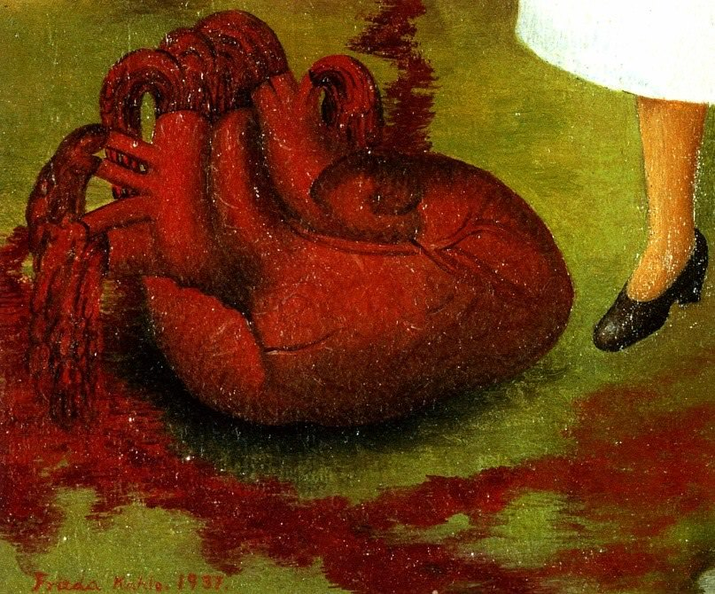

[🏠 Home](../../index.md)

# December 5

## 🧑‍🎨 Painting of the day

[Frida Kahlo](http://en.wikipedia.org/wiki/Frida_Kahlo) (Primitivism, Surrealism)

<button class="btn btn-success"
onclick=" window.open('https://lens.google.com/uploadbyurl?url=https://iretes.github.io/one-a-day/data/img/Frida_Kahlo_2.jpg','_blank')">
Search with Google Lens
</button>

## 🎼 Song of the day

> *With a Little Help From My Friends*
by The Beatles

 Written by John Lennon, Paul McCartney.

Released in June , 1967.

<button class="btn btn-success"
onclick=" window.open('http://www.youtube.com/search?q=With a Little Help From My Friends by The Beatles','_blank')">
Search on YouTube
</button>

## 🏛️ UNESCO heritage site of the day

> *Monte San Giorgio*, Italy,Switzerland

The pyramid-shaped, wooded mountain of Monte San Giorgio beside Lake Lugano is regarded as the best fossil record of marine life from the Triassic Period (245–230 million years ago). The sequence records life in a tropical lagoon environment, sheltered and partially separated from the open sea by an offshore reef. Diverse marine life flourished within this lagoon, including reptiles, fish, bivalves, ammonites, echinoderms and crustaceans. Because the lagoon was near land, the remains also include land-based fossils of reptiles, insects and plants, resulting in an extremely rich source of fossils.

<button class="btn btn-success"
onclick=" window.open('http://www.google.com/search?q=Monte San Giorgio','_blank')">
Search on Google
</button>

## 🗺️ Place of the day

<iframe
src="https://www.mapcrunch.com"
name="mapcrunch"
width="500"
height="500"
allowTransparency="true"
scrolling="no"
frameborder="0"
>
</iframe>
## 🎨 Color of the day

> *[Dark olive green](https://en.wikipedia.org/wiki/Olive_(color)#Dark_olive_green)*

&#9632;

## 🌿 Plant of the day

> *english bulls eye*

<button class="btn btn-success"
onclick=" window.open('http://www.google.com/search?q=english bulls eye','_blank')">
Search on Google
</button>

## 🧑‍🔬 Scientific discovery of the day

> *2nd century BC: Hipparchos discovers Axial precession.*

<button class="btn btn-success"
onclick=" window.open('http://www.google.com/search?q=2nd century BC: Hipparchos discovers Axial precession.','_blank')"> 
Search on Google
</button>

## 💭 Philosophical concept of the day

> *[Utility](https://en.wikipedia.org/wiki/Utility)*

## 🗣️ Saying of the day

> *Infra dig*

Unbecoming of one's position - beneath one's dignity. 

## 🏳️‍🌈 International day

International Volunteer Day for Economic and Social Development, World Soil Day.