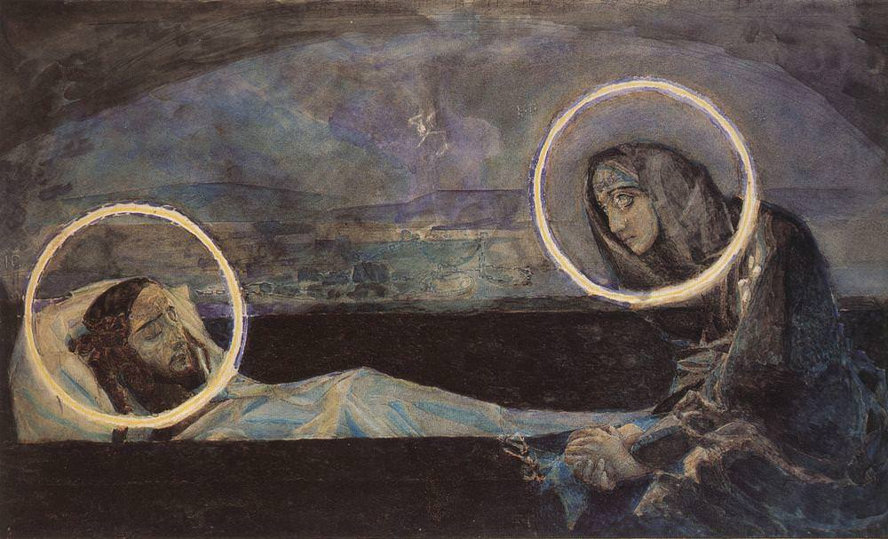

[🏠 Home](../../index.md)

# December 6

## 🧑‍🎨 Painting of the day

[Mikhail Vrubel](http://en.wikipedia.org/wiki/Mikhail_Vrubel) (Symbolism)

<button class="btn btn-success"
onclick=" window.open('https://lens.google.com/uploadbyurl?url=https://iretes.github.io/one-a-day/data/img/Mikhail_Vrubel_5.jpg','_blank')">
Search with Google Lens
</button>

## 🎼 Song of the day

> *Ruby Tuesday*
by The Rolling Stones

 Written by Mick Jagger, Keith Richards.

Released in Jan. , 1967.

<button class="btn btn-success"
onclick=" window.open('http://www.youtube.com/search?q=Ruby Tuesday by The Rolling Stones','_blank')">
Search on YouTube
</button>

## 🏛️ UNESCO heritage site of the day

> *White City of Tel-Aviv – the Modern Movement*, Israel

Tel Aviv was founded in 1909 and developed as a metropolitan city under the British Mandate in Palestine. The White City was constructed from the early 1930s until the 1950s, based on the urban plan by Sir Patrick Geddes, reflecting modern organic planning principles. The buildings were designed by architects who were trained in Europe where they practised their profession before immigrating. They created an outstanding architectural ensemble of the Modern Movement in a new cultural context.

<button class="btn btn-success"
onclick=" window.open('http://www.google.com/search?q=White City of Tel-Aviv – the Modern Movement','_blank')">
Search on Google
</button>

## 🗺️ Place of the day

<iframe
src="https://www.mapcrunch.com"
name="mapcrunch"
width="500"
height="500"
allowTransparency="true"
scrolling="no"
frameborder="0"
>
</iframe>
## 🎨 Color of the day

> *[Fawn](https://en.wikipedia.org/wiki/Fawn_(colour))*

&#9632;

## 🌿 Plant of the day

> *swamp silkweed*

<button class="btn btn-success"
onclick=" window.open('http://www.google.com/search?q=swamp silkweed','_blank')">
Search on Google
</button>

## 🧑‍🔬 Scientific discovery of the day

> *150: The Almagest of Ptolemy contains evidence of the Hellenistic zero. Unlike the earlier Babylonian zero, the Hellenistic zero could be used alone, or at the end of a number. However, it was usually used in the fractional part of a numeral, and was not regarded as a true arithmetical number itself.*

<button class="btn btn-success"
onclick=" window.open('http://www.google.com/search?q=150: The Almagest of Ptolemy contains evidence of the Hellenistic zero. Unlike the earlier Babylonian zero, the Hellenistic zero could be used alone, or at the end of a number. However, it was usually used in the fractional part of a numeral, and was not regarded as a true arithmetical number itself.','_blank')">
Search on Google
</button>

## 💭 Philosophical concept of the day

> *[Universality](https://en.wikipedia.org/wiki/Universality_(philosophy))*

## 🗣️ Saying of the day

> *Stranger danger*

A slogan, intended to alert children to the risks posed by people they do not know. 
