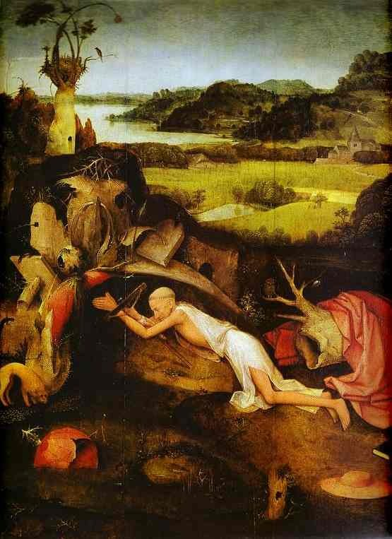

[🏠 Home](../../index.md)

# December 7

## 🧑‍🎨 Painting of the day

[Hieronymus Bosch](http://en.wikipedia.org/wiki/Hieronymus_Bosch) (Northern Renaissance)

<button class="btn btn-success"
onclick=" window.open('https://lens.google.com/uploadbyurl?url=https://iretes.github.io/one-a-day/data/img/Hieronymus_Bosch_5.jpg','_blank')">
Search with Google Lens
</button>

## 🎼 Song of the day

> *Blue Eyes Crying in the Rain*
by Willie Nelson

 Written by Fred Rose.

Released in July , 1975.

<button class="btn btn-success"
onclick=" window.open('http://www.youtube.com/search?q=Blue Eyes Crying in the Rain by Willie Nelson','_blank')">
Search on YouTube
</button>

## 🏛️ UNESCO heritage site of the day

> *Gough and Inaccessible Islands*, United Kingdom of Great Britain and Northern Ireland

The site, located in the south Atlantic, is one of the least-disrupted island and marine ecosystems in the cool temperate zone. The spectacular cliffs of Gough and Inaccessible Islands, towering above the ocean, are free of introduced mammals and home to one of the world’s largest colonies of sea birds. Gough Island is home to two endemic species of land birds, the gallinule and the Gough rowettie, as well as to 12 endemic species of plants, while Inaccessible Island boasts two birds, eight plants and at least 10 invertebrates endemic to the island.

<button class="btn btn-success"
onclick=" window.open('http://www.google.com/search?q=Gough and Inaccessible Islands','_blank')">
Search on Google
</button>

## 🗺️ Place of the day

<iframe
src="https://www.mapcrunch.com"
name="mapcrunch"
width="500"
height="500"
allowTransparency="true"
scrolling="no"
frameborder="0"
>
</iframe>
## 🎨 Color of the day

> *[Wisteria](https://en.wikipedia.org/wiki/Lavender_(color)#Light_lavender_(wisteria))*

&#9632;

## 🌿 Plant of the day

> *silky dogwood*

<button class="btn btn-success"
onclick=" window.open('http://www.google.com/search?q=silky dogwood','_blank')">
Search on Google
</button>

## 🧑‍🔬 Scientific discovery of the day

> *499: Aryabhata discovers the formula for the simplicial numbers (the sums of consecutive cube numbers).*

<button class="btn btn-success"
onclick=" window.open('http://www.google.com/search?q=499: Aryabhata discovers the formula for the simplicial numbers (the sums of consecutive cube numbers).','_blank')">
Search on Google
</button>

## 💭 Philosophical concept of the day

> *[God](https://en.wikipedia.org/wiki/God)*

## 🗣️ Saying of the day

> *Wax poetic*

Speak niin an increasingly enthusiastic and poetic manner.

## 🏳️‍🌈 International day

International Civil Aviation Day.