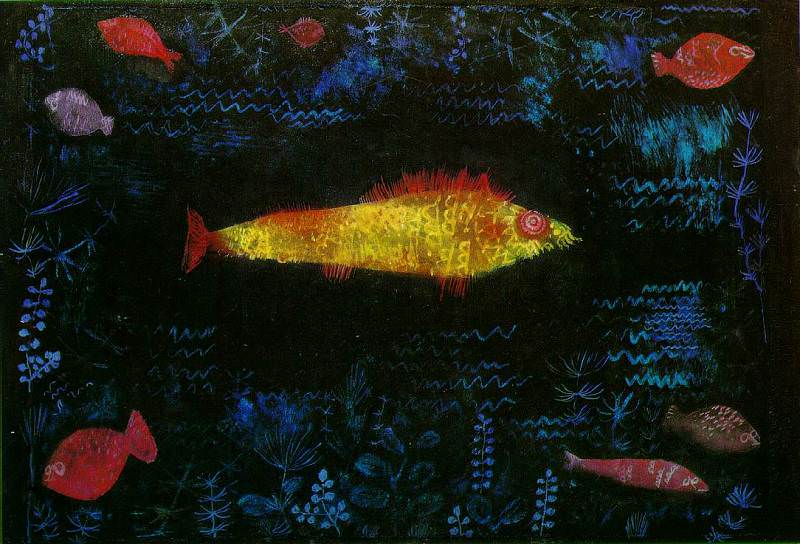

[🏠 Home](../../index.md)

# December 8

## 🧑‍🎨 Painting of the day

[Paul Klee](https://en.wikipedia.org/wiki/Paul_Klee) (Expressionism, Abstractionism, Surrealism)

<button class="btn btn-success"
onclick=" window.open('https://lens.google.com/uploadbyurl?url=https://iretes.github.io/one-a-day/data/img/Paul_Klee_6.jpg','_blank')">
Search with Google Lens
</button>

## 🎼 Song of the day

> *Da Ya Think Im Sexy?*
by Rod Stewart

 Written by Stewart, Carmine Appice.

Released in Dec. , 1978.

<button class="btn btn-success"
onclick=" window.open('http://www.youtube.com/search?q=Da Ya Think Im Sexy? by Rod Stewart','_blank')">
Search on YouTube
</button>

## 🏛️ UNESCO heritage site of the day

> *Roman Walls of Lugo*, Spain

The walls of Lugo were built in the later part of the 3rd century to defend the Roman town of Lucus. The entire circuit survives intact and is the finest example of late Roman fortifications in western Europe.

<button class="btn btn-success"
onclick=" window.open('http://www.google.com/search?q=Roman Walls of Lugo','_blank')">
Search on Google
</button>

## 🗺️ Place of the day

<iframe
src="https://www.mapcrunch.com"
name="mapcrunch"
width="500"
height="500"
allowTransparency="true"
scrolling="no"
frameborder="0"
>
</iframe>
## 🎨 Color of the day

> *[Flirt](https://en.wikipedia.org/wiki/Red-violet#Flirt)*

&#9632;

## 🌿 Plant of the day

> *whiskey cherry*

<button class="btn btn-success"
onclick=" window.open('http://www.google.com/search?q=whiskey cherry','_blank')">
Search on Google
</button>

## 🧑‍🔬 Scientific discovery of the day

> *9th century: Jain mathematician Mahāvīra writes down a factorisation for the difference of cubes.*

<button class="btn btn-success"
onclick=" window.open('http://www.google.com/search?q=9th century: Jain mathematician Mahāvīra writes down a factorisation for the difference of cubes.','_blank')">
Search on Google
</button>

## 💭 Philosophical concept of the day

> *[Nature](https://en.wikipedia.org/wiki/Nature_(innate))*

## 🗣️ Saying of the day

> *My giddy aunt*

An exclamation of surprise. 
