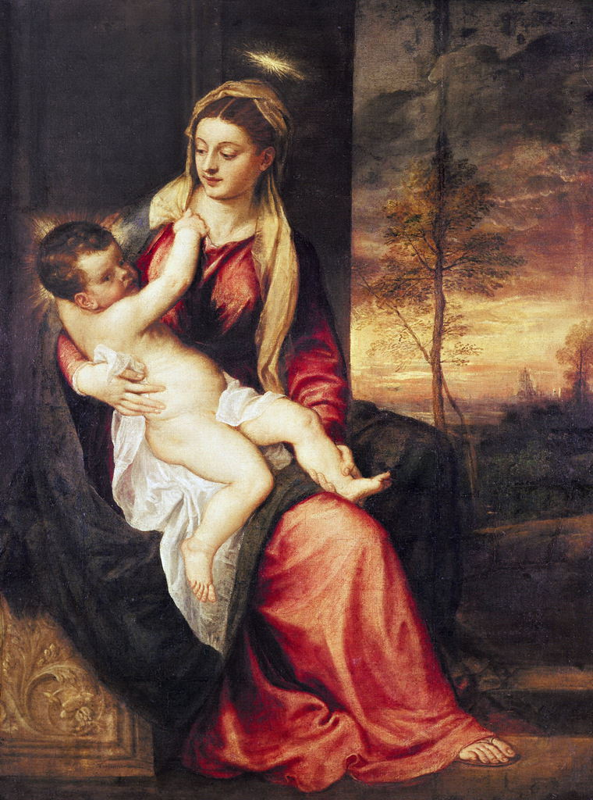

[🏠 Home](../../index.md)

# February 10

## 🧑‍🎨 Painting of the day

[Titian](http://en.wikipedia.org/wiki/Titian) (High Renaissance, Mannerism)

<button class="btn btn-success"
onclick=" window.open('https://lens.google.com/uploadbyurl?url=https://iretes.github.io/one-a-day/data/img/Titian_3.jpg','_blank')">
Search with Google Lens
</button>

## 🎼 Song of the day

> *The Weight*
by The Band

 Written by Robbie Robertson.

Released in Aug, 1968.

<button class="btn btn-success"
onclick=" window.open('http://www.youtube.com/search?q=The Weight by The Band','_blank')">
Search on YouTube
</button>

## 🏛️ UNESCO heritage site of the day

> *Kalwaria Zebrzydowska: the Mannerist Architectural and Park Landscape Complex and Pilgrimage Park*, Poland

Kalwaria Zebrzydowska is a breathtaking cultural landscape of great spiritual significance. Its natural setting – in which a series of symbolic places of worship relating to the Passion of Jesus Christ and the life of the Virgin Mary was laid out at the beginning of the 17th century – has remained virtually unchanged. It is still today a place of pilgrimage.

<button class="btn btn-success"
onclick=" window.open('http://www.google.com/search?q=Kalwaria Zebrzydowska: the Mannerist Architectural and Park Landscape Complex and Pilgrimage Park','_blank')">
Search on Google
</button>

## 🗺️ Place of the day

<iframe
src="https://www.mapcrunch.com"
name="mapcrunch"
width="500"
height="500"
allowTransparency="true"
scrolling="no"
frameborder="0"
>
</iframe>
## 🎨 Color of the day

> *[Steel blue](https://en.wikipedia.org/wiki/Steel_blue)*

&#9632;

## 🌿 Plant of the day

> *red mulberry*

<button class="btn btn-success"
onclick=" window.open('http://www.google.com/search?q=red mulberry','_blank')">
Search on Google
</button>

## 🧑‍🔬 Scientific discovery of the day

> *1922: Frederick Banting, Charles Best, James Collip, John Macleod: isolation and production of insulin to control diabetes*

<button class="btn btn-success"
onclick=" window.open('http://www.google.com/search?q=1922: Frederick Banting, Charles Best, James Collip, John Macleod: isolation and production of insulin to control diabetes','_blank')"> 
Search on Google
</button>

## 💭 Philosophical concept of the day

> *[Conatus](https://en.wikipedia.org/wiki/Conatus)*

## 🗣️ Saying of the day

> *Worse for wear*

Shabby or worn through use; drunk.

## 🏳️‍🌈 International day

International Day of the Arabian Leopard, World Pulses Day.