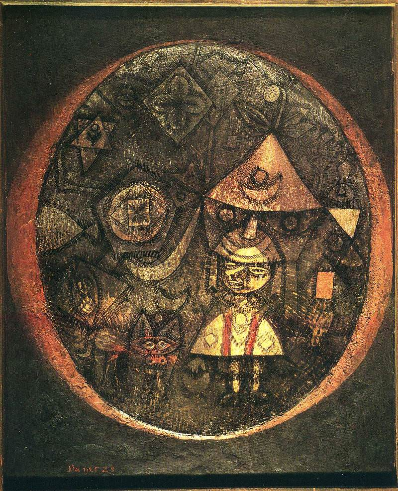

[🏠 Home](../../index.md)

# February 12

## 🧑‍🎨 Painting of the day

[Paul Klee](https://en.wikipedia.org/wiki/Paul_Klee) (Expressionism, Abstractionism, Surrealism)

<button class="btn btn-success"
onclick=" window.open('https://lens.google.com/uploadbyurl?url=https://iretes.github.io/one-a-day/data/img/Paul_Klee_5.jpg','_blank')">
Search with Google Lens
</button>

## 🎼 Song of the day

> *Tutti-Frutti*
by Little Richard

 Written by Dorothy La Bostrie, Richard Penniman, Joe Lubin.

Released in Dec, 1955.

<button class="btn btn-success"
onclick=" window.open('http://www.youtube.com/search?q=Tutti-Frutti by Little Richard','_blank')">
Search on YouTube
</button>

## 🏛️ UNESCO heritage site of the day

> *Hanseatic City of Lübeck*, Germany

L&uuml;beck &ndash; the former capital and Queen City of the Hanseatic League &ndash; was founded in the 12th century and prospered until the 16th century as the major trading centre for northern Europe. It has remained a centre for maritime commerce to this day, particularly with the Nordic countries. Despite the damage it suffered during the Second World War, the basic structure of the old city, consisting mainly of 15th- and 16th-century patrician residences, public monuments (the famous Holstentor brick gate), churches and salt storehouses, remains unaltered.

<button class="btn btn-success"
onclick=" window.open('http://www.google.com/search?q=Hanseatic City of Lübeck','_blank')">
Search on Google
</button>

## 🗺️ Place of the day

<iframe
src="https://www.mapcrunch.com"
name="mapcrunch"
width="500"
height="500"
allowTransparency="true"
scrolling="no"
frameborder="0"
>
</iframe>
## 🎨 Color of the day

> *[Denim blue](https://en.wikipedia.org/wiki/List_of_Crayola_crayon_colors#Heads_&#39;n_Tails)*

&#9632;

## 🌿 Plant of the day

> *scrub oak*

<button class="btn btn-success"
onclick=" window.open('http://www.google.com/search?q=scrub oak','_blank')">
Search on Google
</button>

## 🧑‍🔬 Scientific discovery of the day

> *3000 BC: Units of measurement are developed in the Americas as well as the major Bronze Age civilizations: Egypt, Mesopotamia, Elam and the Indus Valley.*

<button class="btn btn-success"
onclick=" window.open('http://www.google.com/search?q=3000 BC: Units of measurement are developed in the Americas as well as the major Bronze Age civilizations: Egypt, Mesopotamia, Elam and the Indus Valley.','_blank')"> 
Search on Google
</button>

## 💭 Philosophical concept of the day

> *[Presupposition](https://en.wikipedia.org/wiki/Presupposition)*

## 🗣️ Saying of the day

> *Honesty is the best policy*

The proverb 'Honesty is the best policy' has a straightforward literal meaning, which encourages the populace to tell the turth and avoid crime.

## 🏳️‍🌈 International day

International Day for the Prevention of Violent Extremism as and when Conducive to Terrorism.