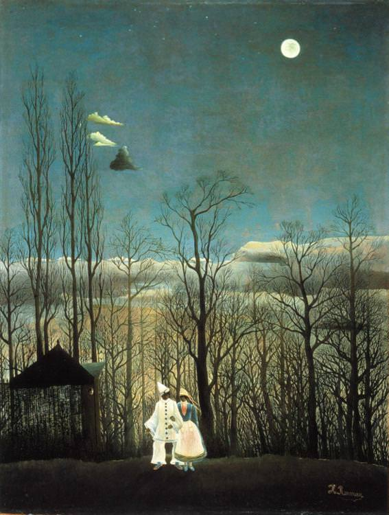

[🏠 Home](../../index.md)

# February 13

## 🧑‍🎨 Painting of the day

[Henri Rousseau](https://en.wikipedia.org/wiki/Henri_Rousseau) (Primitivism)

<button class="btn btn-success"
onclick=" window.open('https://lens.google.com/uploadbyurl?url=https://iretes.github.io/one-a-day/data/img/Henri_Rousseau_7.jpg','_blank')">
Search with Google Lens
</button>

## 🎼 Song of the day

> *Georgia on My Mind*
by Ray Charles

 Written by Hoagy Carmichael, Stuart Gorrell.

Released in Sept, 1960.

<button class="btn btn-success"
onclick=" window.open('http://www.youtube.com/search?q=Georgia on My Mind by Ray Charles','_blank')">
Search on YouTube
</button>

## 🏛️ UNESCO heritage site of the day

> *Monastery of Horezu*, Romania

Founded in 1690 by Prince Constantine Brancovan, the monastery of Horezu, in Walachia, is a masterpiece of the 'Brancovan' style. It is known for its architectural purity and balance, the richness of its sculptural detail, the treatment of its religious compositions, its votive portraits and its painted decorative works. The school of mural and icon painting established at the monastery in the 18th century was famous throughout the Balkan region.

<button class="btn btn-success"
onclick=" window.open('http://www.google.com/search?q=Monastery of Horezu','_blank')">
Search on Google
</button>

## 🗺️ Place of the day

<iframe
src="https://www.mapcrunch.com"
name="mapcrunch"
width="500"
height="500"
allowTransparency="true"
scrolling="no"
frameborder="0"
>
</iframe>
## 🎨 Color of the day

> *[May green](https://en.wikipedia.org/wiki/Spring_bud#May_green)*

&#9632;

## 🌿 Plant of the day

> *african rice*

<button class="btn btn-success"
onclick=" window.open('http://www.google.com/search?q=african rice','_blank')">
Search on Google
</button>

## 🧑‍🔬 Scientific discovery of the day

> *4th century BC: Aristotle differentiates between near-sighted and far-sightedness. Graeco-Roman physician Galen would later use the term "myopia" for near-sightedness.*

<button class="btn btn-success"
onclick=" window.open('http://www.google.com/search?q=4th century BC: Aristotle differentiates between near-sighted and far-sightedness. Graeco-Roman physician Galen would later use the term myopia for near-sightedness.','_blank')"> 
Search on Google
</button>

## 💭 Philosophical concept of the day

> *[Pneuma](https://en.wikipedia.org/wiki/Pneuma)*

## 🗣️ Saying of the day

> *Jam tomorrow*

'Jam tomorrow' is some pleasant event in the future, which is never likely to materialize.

## 🏳️‍🌈 International day

World Radio Day.