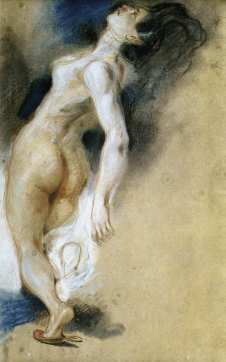

[🏠 Home](../../index.md)

# February 14

## 🧑‍🎨 Painting of the day

[Eugene Delacroix](https://en.wikipedia.org/wiki/Eugène_Delacroix) (Romanticism)

<button class="btn btn-success"
onclick=" window.open('https://lens.google.com/uploadbyurl?url=https://iretes.github.io/one-a-day/data/img/Eugene_Delacroix_3.jpg','_blank')">
Search with Google Lens
</button>

## 🎼 Song of the day

> *Heartbreak Hotel*
by Elvis Presley

 Written by Mae Boren Axton, Tommy Durden, Presley.

Released in Jan, 1956.

<button class="btn btn-success"
onclick=" window.open('http://www.youtube.com/search?q=Heartbreak Hotel by Elvis Presley','_blank')">
Search on YouTube
</button>

## 🏛️ UNESCO heritage site of the day

> *Acropolis, Athens*, Greece

The Acropolis of Athens and its monuments are universal symbols of the classical spirit and civilization and form the greatest architectural and artistic complex bequeathed by Greek Antiquity to the world. In the second half of the fifth century bc, Athens, following the victory against the Persians and the establishment of democracy, took a leading position amongst the other city-states of the ancient world. In the age that followed, as thought and art flourished, an exceptional group of artists put into effect the ambitious plans of Athenian statesman Pericles and, under the inspired guidance of the sculptor Pheidias, transformed the rocky hill into a unique monument of thought and the arts. The most important monuments were built during that time: the Parthenon, built by Ictinus, the Erechtheon, the Propylaea, the monumental entrance to the Acropolis, designed by Mnesicles and the small temple Athena Nike.&nbsp;

<button class="btn btn-success"
onclick=" window.open('http://www.google.com/search?q=Acropolis, Athens','_blank')">
Search on Google
</button>

## 🗺️ Place of the day

<iframe
src="https://www.mapcrunch.com"
name="mapcrunch"
width="500"
height="500"
allowTransparency="true"
scrolling="no"
frameborder="0"
>
</iframe>
## 🎨 Color of the day

> *[Fern green](https://en.wikipedia.org/wiki/Shades_of_green#Fern_green)*

&#9632;

## 🌿 Plant of the day

> *buckeye california buckeye*

<button class="btn btn-success"
onclick=" window.open('http://www.google.com/search?q=buckeye california buckeye','_blank')">
Search on Google
</button>

## 🧑‍🔬 Scientific discovery of the day

> *Early 2nd millennium BC: Similar triangles and side-ratios are studied in Egypt for the construction of pyramids, paving the way for the field of trigonometry.*

<button class="btn btn-success"
onclick=" window.open('http://www.google.com/search?q=Early 2nd millennium BC: Similar triangles and side-ratios are studied in Egypt for the construction of pyramids, paving the way for the field of trigonometry.','_blank')">
Search on Google
</button>

## 💭 Philosophical concept of the day

> *[Polychotomous key](https://en.wikipedia.org/wiki/Polychotomous_key)*

## 🗣️ Saying of the day

> *Good men and true*

Dependable men, of rank and honour. The phrase was adapted later to 'twelve good men and true', indicating the twelve (originally all men, now both sexes) of a criminal jury. 
