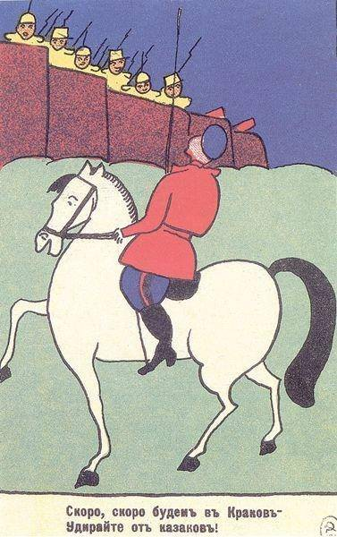

[🏠 Home](../../index.md)

# February 15

## 🧑‍🎨 Painting of the day

[Kazimir Malevich](http://en.wikipedia.org/wiki/Kazimir_Malevich) (Suprematism)

<button class="btn btn-success"
onclick=" window.open('https://lens.google.com/uploadbyurl?url=https://iretes.github.io/one-a-day/data/img/Kazimir_Malevich_1.jpg','_blank')">
Search with Google Lens
</button>

## 🎼 Song of the day

> *Heroes*
by David Bowie

 Written by Bowie, Brian Eno.

Released in Sept, 1977.

<button class="btn btn-success"
onclick=" window.open('http://www.youtube.com/search?q=Heroes by David Bowie','_blank')">
Search on YouTube
</button>

## 🏛️ UNESCO heritage site of the day

> *Old Town of Ghadamès*, Libya

Ghadamès, known as 'the pearl of the desert', stands in an oasis. It is one of the oldest pre-Saharan cities and an outstanding example of a traditional settlement. Its domestic architecture is characterized by a vertical division of functions: the ground floor used to store supplies; then another floor for the family, overhanging covered alleys that create what is almost an underground network of passageways; and, at the top, open-air terraces reserved for the women.

<button class="btn btn-success"
onclick=" window.open('http://www.google.com/search?q=Old Town of Ghadamès','_blank')">
Search on Google
</button>

## 🗺️ Place of the day

<iframe
src="https://www.mapcrunch.com"
name="mapcrunch"
width="500"
height="500"
allowTransparency="true"
scrolling="no"
frameborder="0"
>
</iframe>
## 🎨 Color of the day

> *[Maroon (Crayola)](https://en.wikipedia.org/wiki/Maroon#Maroon_(Crayola))*

&#9632;

## 🌿 Plant of the day

> *common alder*

<button class="btn btn-success"
onclick=" window.open('http://www.google.com/search?q=common alder','_blank')">
Search on Google
</button>

## 🧑‍🔬 Scientific discovery of the day

> *1911: Heike Kamerlingh Onnes: Superconductivity*

<button class="btn btn-success"
onclick=" window.open('http://www.google.com/search?q=1911: Heike Kamerlingh Onnes: Superconductivity','_blank')"> 
Search on Google
</button>

## 💭 Philosophical concept of the day

> *[Rights](https://en.wikipedia.org/wiki/Rights)*

## 🗣️ Saying of the day

> *Raining stair-rods*

Raining stair rods means 'aining very heavily'.
