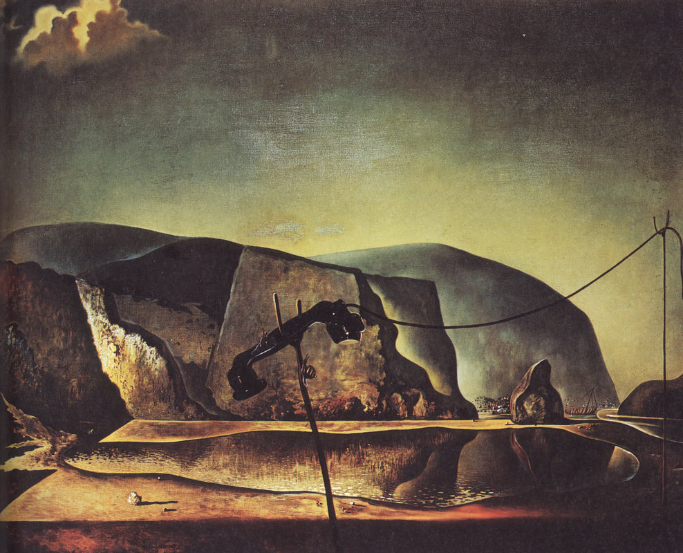

[🏠 Home](../../index.md)

# February 17

## 🧑‍🎨 Painting of the day

[Salvador Dali](http://en.wikipedia.org/wiki/Salvador_Dalí) (Surrealism)

<button class="btn btn-success"
onclick=" window.open('https://lens.google.com/uploadbyurl?url=https://iretes.github.io/one-a-day/data/img/Salvador_Dali_6.jpg','_blank')">
Search with Google Lens
</button>

## 🎼 Song of the day

> *Bridge Over Troubled Water*
by Simon and Garfunkel

 Written by Paul Simon.

Released in Feb, 1970.

<button class="btn btn-success"
onclick=" window.open('http://www.youtube.com/search?q=Bridge Over Troubled Water by Simon and Garfunkel','_blank')">
Search on YouTube
</button>

## 🏛️ UNESCO heritage site of the day

> *Longmen Grottoes*, China

The grottoes and niches of Longmen contain the largest and most impressive collection of Chinese art of the late Northern Wei and Tang Dynasties (316-907). These works, entirely devoted to the Buddhist religion, represent the high point of Chinese stone carving.

<button class="btn btn-success"
onclick=" window.open('http://www.google.com/search?q=Longmen Grottoes','_blank')">
Search on Google
</button>

## 🗺️ Place of the day

<iframe
src="https://www.mapcrunch.com"
name="mapcrunch"
width="500"
height="500"
allowTransparency="true"
scrolling="no"
frameborder="0"
>
</iframe>
## 🎨 Color of the day

> *[Big dip o’ruby](https://en.wikipedia.org/wiki/Ruby_(color)#Big_dip_o&#39;ruby)*

&#9632;

## 🌿 Plant of the day

> *broadleaf plantain*

<button class="btn btn-success"
onclick=" window.open('http://www.google.com/search?q=broadleaf plantain','_blank')">
Search on Google
</button>

## 🧑‍🔬 Scientific discovery of the day

> *1912: Henrietta Swan Leavitt: Cepheid variable period-luminosity relation*

<button class="btn btn-success"
onclick=" window.open('http://www.google.com/search?q=1912: Henrietta Swan Leavitt: Cepheid variable period-luminosity relation','_blank')"> 
Search on Google
</button>

## 💭 Philosophical concept of the day

> *[Just War](https://en.wikipedia.org/wiki/Just_War)*

## 🗣️ Saying of the day

> *A foregone conclusion*

A decision made before the evidence for it is known. An inevitable conclusion. 

## 🏳️‍🌈 International day

Global Tourism Resilience Day.