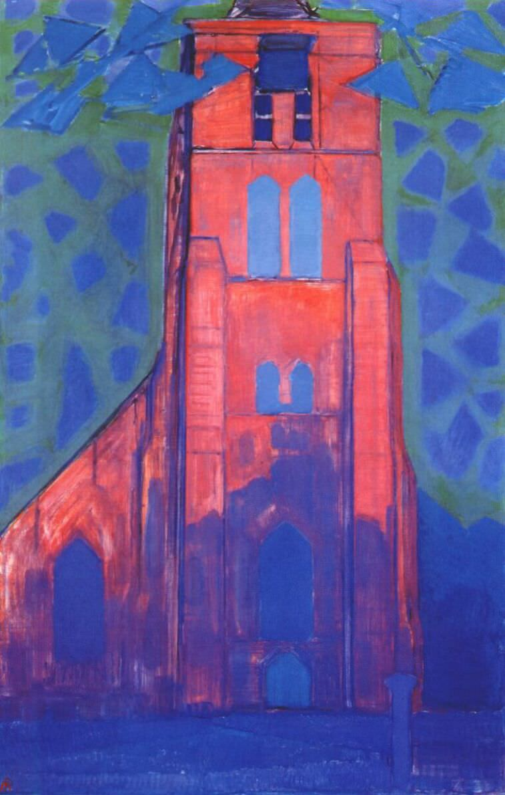

[🏠 Home](../../index.md)

# February 18

## 🧑‍🎨 Painting of the day

[Piet Mondrian](https://en.wikipedia.org/wiki/Piet_Mondrian) (Neoplasticism)

<button class="btn btn-success"
onclick=" window.open('https://lens.google.com/uploadbyurl?url=https://iretes.github.io/one-a-day/data/img/Piet_Mondrian_3.jpg','_blank')">
Search with Google Lens
</button>

## 🎼 Song of the day

> *Hotel California*
by The Eagles

 Written by Don Felder, Glenn Frey, Don Henley.

Released in Dec, 1976.

<button class="btn btn-success"
onclick=" window.open('http://www.youtube.com/search?q=Hotel California by The Eagles','_blank')">
Search on YouTube
</button>

## 🏛️ UNESCO heritage site of the day

> *Town of Luang Prabang*, Lao People's Democratic Republic

Luang Prabang is an outstanding example of the fusion of traditional architecture and Lao urban structures with those built by the European colonial authorities in the 19th and 20th centuries. Its unique, remarkably well-preserved townscape illustrates a key stage in the blending of these two distinct cultural traditions.

<button class="btn btn-success"
onclick=" window.open('http://www.google.com/search?q=Town of Luang Prabang','_blank')">
Search on Google
</button>

## 🗺️ Place of the day

<iframe
src="https://www.mapcrunch.com"
name="mapcrunch"
width="500"
height="500"
allowTransparency="true"
scrolling="no"
frameborder="0"
>
</iframe>
## 🎨 Color of the day

> *[Timberwolf](https://en.wikipedia.org/wiki/List_of_Crayola_crayon_colors)*

&#9632;

## 🌿 Plant of the day

> *bay laurel*

<button class="btn btn-success"
onclick=" window.open('http://www.google.com/search?q=bay laurel','_blank')">
Search on Google
</button>

## 🧑‍🔬 Scientific discovery of the day

> *1805: John Dalton: Atomic Theory in (chemistry).*

<button class="btn btn-success"
onclick=" window.open('http://www.google.com/search?q=1805: John Dalton: Atomic Theory in (chemistry).','_blank')">
Search on Google
</button>

## 💭 Philosophical concept of the day

> *[Justice](https://en.wikipedia.org/wiki/Justice)*

## 🗣️ Saying of the day

> *Is the Pope Polish?*

A jokey alternative version of 'Is the Pope Catholic?'.
