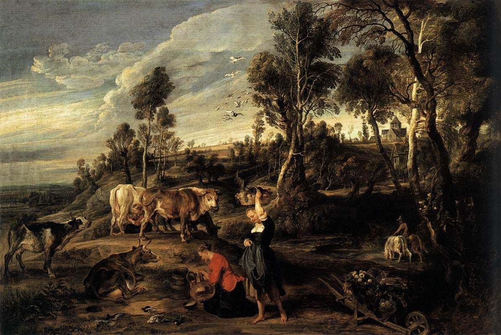

[🏠 Home](../../index.md)

# February 19

## 🧑‍🎨 Painting of the day

[Peter Paul Rubens](http://en.wikipedia.org/wiki/Peter_Paul_Rubens) (Baroque)

<button class="btn btn-success"
onclick=" window.open('https://lens.google.com/uploadbyurl?url=https://iretes.github.io/one-a-day/data/img/Peter_Paul_Rubens_3.jpg','_blank')">
Search with Google Lens
</button>

## 🎼 Song of the day

> *The Tracks of My Tears*
by Smokey Robinson and the Miracles

 Written by Pete Moore, Robinson, Marv Tamplin.

Released in June, 1965.

<button class="btn btn-success"
onclick=" window.open('http://www.youtube.com/search?q=The Tracks of My Tears by Smokey Robinson and the Miracles','_blank')">
Search on YouTube
</button>

## 🏛️ UNESCO heritage site of the day

> *Historic City of Ayutthaya*, Thailand

Founded c. 1350, Ayutthaya became the second Siamese capital after Sukhothai. It was destroyed by the Burmese in the 18th century. Its remains, characterized by the prang (reliquary towers) and gigantic monasteries, give an idea of its past splendour.

<button class="btn btn-success"
onclick=" window.open('http://www.google.com/search?q=Historic City of Ayutthaya','_blank')">
Search on Google
</button>

## 🗺️ Place of the day

<iframe
src="https://www.mapcrunch.com"
name="mapcrunch"
width="500"
height="500"
allowTransparency="true"
scrolling="no"
frameborder="0"
>
</iframe>
## 🎨 Color of the day

> *[Phthalo green](https://en.wikipedia.org/wiki/Phthalocyanine_Green_G)*

&#9632;

## 🌿 Plant of the day

> *coast live oak*

<button class="btn btn-success"
onclick=" window.open('http://www.google.com/search?q=coast live oak','_blank')">
Search on Google
</button>

## 🧑‍🔬 Scientific discovery of the day

> *984: Ibn Sahl discovers Snell's law.*

<button class="btn btn-success"
onclick=" window.open('http://www.google.com/search?q=984: Ibn Sahl discovers Snell s law.','_blank')"> 
Search on Google
</button>

## 💭 Philosophical concept of the day

> *[Physis](https://en.wikipedia.org/wiki/Physis)*

## 🗣️ Saying of the day

> *The blind leading the blind*

Uninformed
and incompetent people leading others who are similarly incapable.
