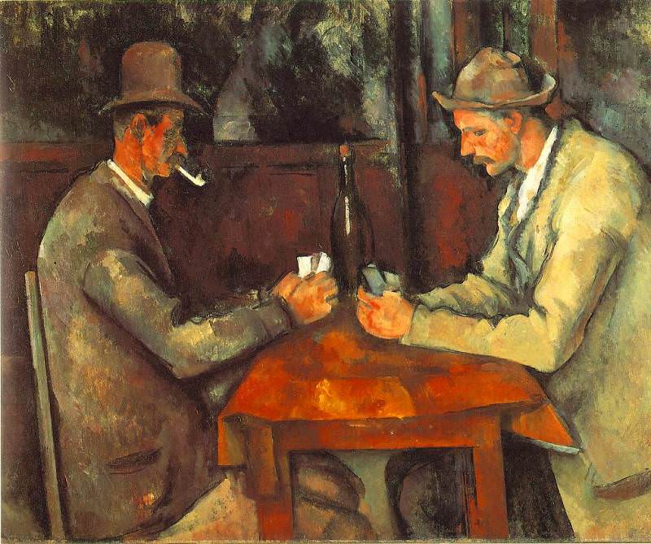

[🏠 Home](../../index.md)

# February 20

## 🧑‍🎨 Painting of the day

[Paul Cezanne](https://en.wikipedia.org/wiki/Paul_Cézanne) (Post-Impressionism)

<button class="btn btn-success"
onclick=" window.open('https://lens.google.com/uploadbyurl?url=https://iretes.github.io/one-a-day/data/img/Paul_Cezanne_8.jpg','_blank')">
Search with Google Lens
</button>

## 🎼 Song of the day

> *Crazy*
by Gnarls Barkley

 Written by Brian Burton, Thomas Calloway, Gianfranco Reverberi, Gian Piero Reverberi.

Released in May , 1906.

<button class="btn btn-success"
onclick=" window.open('http://www.youtube.com/search?q=Crazy by Gnarls Barkley','_blank')">
Search on YouTube
</button>

## 🏛️ UNESCO heritage site of the day

> *Temple of Preah Vihear*, Cambodia

Situated on the edge of a plateau that dominates the plain of Cambodia, the Temple of Preah Vihear is dedicated to Shiva. The Temple is composed of a series of sanctuaries linked by a system of pavements and staircases over an 800 metre long axis and dates back to the first half of the 11th century AD. Nevertheless, its complex history can be traced to the 9th century, when the hermitage was founded. This site is particularly well preserved, mainly due to its remote location. The site is exceptional for the quality of its architecture, which is adapted to the natural environment and the religious function of the temple, as well as for the exceptional quality of its carved stone ornamentation.

<button class="btn btn-success"
onclick=" window.open('http://www.google.com/search?q=Temple of Preah Vihear','_blank')">
Search on Google
</button>

## 🗺️ Place of the day

<iframe
src="https://www.mapcrunch.com"
name="mapcrunch"
width="500"
height="500"
allowTransparency="true"
scrolling="no"
frameborder="0"
>
</iframe>
## 🎨 Color of the day

> *[Pewter Blue](https://en.wikipedia.org/wiki/List_of_Crayola_crayon_colors#Silver_Swirls)*

&#9632;

## 🌿 Plant of the day

> *dwarf wild rose*

<button class="btn btn-success"
onclick=" window.open('http://www.google.com/search?q=dwarf wild rose','_blank')">
Search on Google
</button>

## 🧑‍🔬 Scientific discovery of the day

> *1609: Johannes Kepler: first two laws of planetary motion.*

<button class="btn btn-success"
onclick=" window.open('http://www.google.com/search?q=1609: Johannes Kepler: first two laws of planetary motion.','_blank')"> 
Search on Google
</button>

## 💭 Philosophical concept of the day

> *[Ring of Gyges](https://en.wikipedia.org/wiki/Ring_of_Gyges)*

## 🗣️ Saying of the day

> *High and mighty*

Powerful and superior, or arrogantly affecting to be so.

## 🏳️‍🌈 International day

World Day of Social Justice.