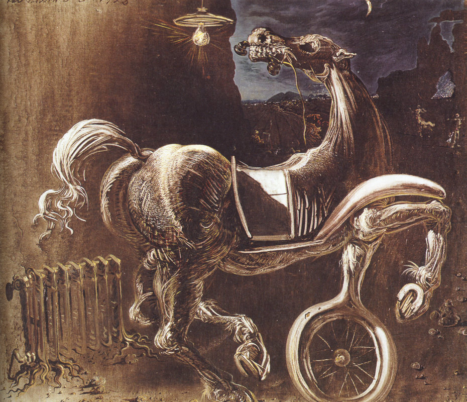

[🏠 Home](../../index.md)

# February 21

## 🧑‍🎨 Painting of the day

[Salvador Dali](http://en.wikipedia.org/wiki/Salvador_Dalí) (Surrealism)

<button class="btn btn-success"
onclick=" window.open('https://lens.google.com/uploadbyurl?url=https://iretes.github.io/one-a-day/data/img/Salvador_Dali_4.jpg','_blank')">
Search with Google Lens
</button>

## 🎼 Song of the day

> *Fortunate Son*
by Creedence Clearwater Revival

 Written by John Fogerty.

Released in Oct. , 1969.

<button class="btn btn-success"
onclick=" window.open('http://www.youtube.com/search?q=Fortunate Son by Creedence Clearwater Revival','_blank')">
Search on YouTube
</button>

## 🏛️ UNESCO heritage site of the day

> *Historic Centres of Berat and Gjirokastra *, Albania

Berat and Gjirokastra are inscribed as rare examples of an architectural character typical of the Ottoman period. Located in central Albania, Berat bears witness to the coexistence of various religious and cultural communities down the centuries. It features a castle, locally known as the Kala, most of which was built in the 13th century, although its origins date back to the 4th century BC. The citadel area numbers many Byzantine churches, mainly from the 13th century, as well as several mosques built under the Ottoman era which began in 1417. Gjirokastra, in the Drinos river valley in southern Albania, features a series of outstanding two-story houses which were developed in the 17th century. The town also retains a bazaar, an 18th-century mosque and two churches of the same period.

<button class="btn btn-success"
onclick=" window.open('http://www.google.com/search?q=Historic Centres of Berat and Gjirokastra ','_blank')">
Search on Google
</button>

## 🗺️ Place of the day

<iframe
src="https://www.mapcrunch.com"
name="mapcrunch"
width="500"
height="500"
allowTransparency="true"
scrolling="no"
frameborder="0"
>
</iframe>
## 🎨 Color of the day

> *[Burnt umber](https://en.wikipedia.org/wiki/Burnt_umber)*

&#9632;

## 🌿 Plant of the day

> *wild black cherry*

<button class="btn btn-success"
onclick=" window.open('http://www.google.com/search?q=wild black cherry','_blank')">
Search on Google
</button>

## 🧑‍🔬 Scientific discovery of the day

> *1868: Robert Forester Mushet discovers that alloying steel with tungsten produces a harder, more durable alloy..*

<button class="btn btn-success"
onclick=" window.open('http://www.google.com/search?q=1868: Robert Forester Mushet discovers that alloying steel with tungsten produces a harder, more durable alloy..','_blank')">
Search on Google
</button>

## 💭 Philosophical concept of the day

> *[Human rights](https://en.wikipedia.org/wiki/Human_rights)*

## 🗣️ Saying of the day

> *Man does not live by bread alone*

Physical nourishment is not sufficient for a healthy life; man also has spiritual needs.

## 🏳️‍🌈 International day

International Mother Language Day.