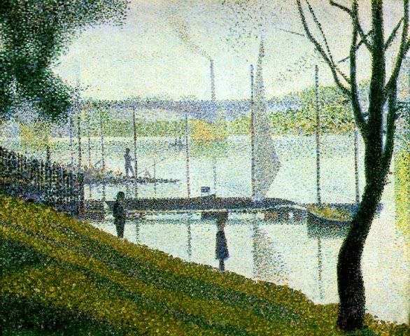

[🏠 Home](../../index.md)

# February 22

## 🧑‍🎨 Painting of the day

[Georges Seurat](https://en.wikipedia.org/wiki/Georges_Seurat) (Post-Impressionism)

<button class="btn btn-success"
onclick=" window.open('https://lens.google.com/uploadbyurl?url=https://iretes.github.io/one-a-day/data/img/Georges_Seurat_4.jpg','_blank')">
Search with Google Lens
</button>

## 🎼 Song of the day

> *Love and Happiness*
by Al Green

 Written by Green, Mabon "Teenie" Hodges.

Released in June , 1972.

<button class="btn btn-success"
onclick=" window.open('http://www.youtube.com/search?q=Love and Happiness by Al Green','_blank')">
Search on YouTube
</button>

## 🏛️ UNESCO heritage site of the day

> *Historic Centre of Prague*, Czechia

Built between the 11th and 18th centuries, the Old Town, the Lesser Town and the New Town speak of the great architectural and cultural influence enjoyed by this city since the Middle Ages. The many magnificent monuments, such as Hradcany Castle, St Vitus Cathedral, Charles Bridge and numerous churches and palaces, built mostly in the 14th century under the Holy Roman Emperor, Charles IV.

<button class="btn btn-success"
onclick=" window.open('http://www.google.com/search?q=Historic Centre of Prague','_blank')">
Search on Google
</button>

## 🗺️ Place of the day

<iframe
src="https://www.mapcrunch.com"
name="mapcrunch"
width="500"
height="500"
allowTransparency="true"
scrolling="no"
frameborder="0"
>
</iframe>
## 🎨 Color of the day

> *[Glaucous](https://en.wikipedia.org/wiki/Glaucous)*

&#9632;

## 🌿 Plant of the day

> *sweet birch*

<button class="btn btn-success"
onclick=" window.open('http://www.google.com/search?q=sweet birch','_blank')">
Search on Google
</button>

## 🧑‍🔬 Scientific discovery of the day

> *1st to 4th century: A precursor to long division, known as "galley division" is developed at some point. Its discovery is generally believed to have originated in India around the 4th century AD, although Singaporean mathematician Lam Lay Yong claims that the method is found in the Chinese text The Nine Chapters on the Mathematical Art, from the 1st century AD.*

<button class="btn btn-success"
onclick=" window.open('http://www.google.com/search?q=1st to 4th century: A precursor to long division, known as "galley division" is developed at some point. Its discovery is generally believed to have originated in India around the 4th century AD, although Singaporean mathematician Lam Lay Yong claims that the method is found in the Chinese text The Nine Chapters on the Mathematical Art, from the 1st century AD.','_blank')">
Search on Google
</button>

## 💭 Philosophical concept of the day

> *[Mimesis](https://en.wikipedia.org/wiki/Mimesis)*

## 🗣️ Saying of the day

> *Clod-hopper*

A rough, unsophisticated countryman. 
