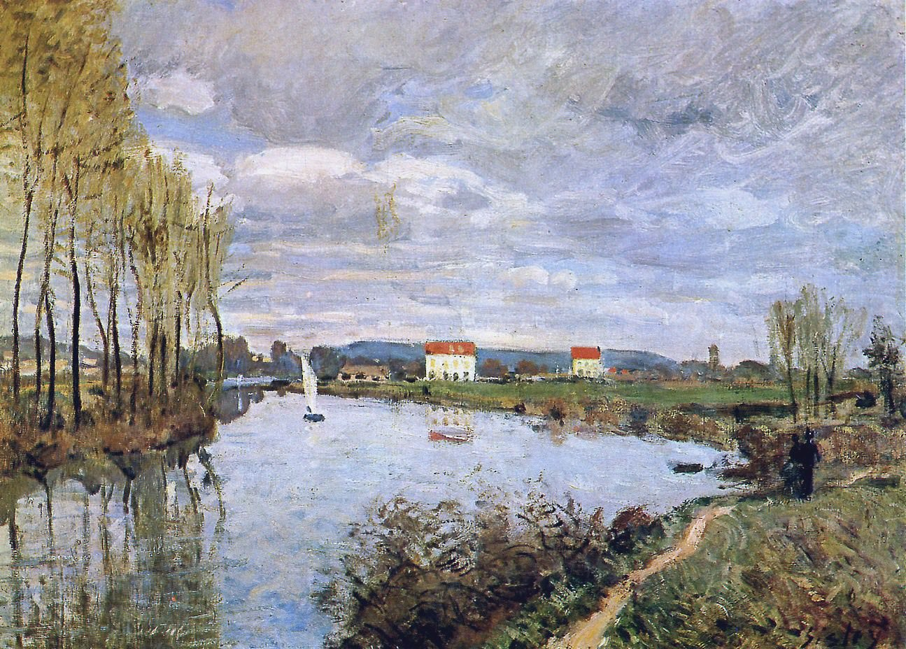

[🏠 Home](../../index.md)

# February 23

## 🧑‍🎨 Painting of the day

[Alfred Sisley](http://en.wikipedia.org/wiki/Alfred_Sisley) (Impressionism)

<button class="btn btn-success"
onclick=" window.open('https://lens.google.com/uploadbyurl?url=https://iretes.github.io/one-a-day/data/img/Alfred_Sisley_2.jpg','_blank')">
Search with Google Lens
</button>

## 🎼 Song of the day

> *Roll Over Beethoven*
by Chuck Berry

 Written by Berry.

Released in May , 1956.

<button class="btn btn-success"
onclick=" window.open('http://www.youtube.com/search?q=Roll Over Beethoven by Chuck Berry','_blank')">
Search on YouTube
</button>

## 🏛️ UNESCO heritage site of the day

> *Rock Carvings in Tanum*, Sweden

The rock carvings in Tanum, in the north of Bohuslän, are a unique artistic achievement not only for their rich and varied motifs (depictions of humans and animals, weapons, boats and other subjects) but also for their cultural and chronological unity. They reveal the life and beliefs of people in Europe during the Bronze Age and are remarkable for their large numbers and outstanding quality.

<button class="btn btn-success"
onclick=" window.open('http://www.google.com/search?q=Rock Carvings in Tanum','_blank')">
Search on Google
</button>

## 🗺️ Place of the day

<iframe
src="https://www.mapcrunch.com"
name="mapcrunch"
width="500"
height="500"
allowTransparency="true"
scrolling="no"
frameborder="0"
>
</iframe>
## 🎨 Color of the day

> *[Periwinkle (Crayola)](https://en.wikipedia.org/wiki/Periwinkle_(color)#Periwinkle_(Crayola))*

&#9632;

## 🌿 Plant of the day

> *toothwort*

<button class="btn btn-success"
onclick=" window.open('http://www.google.com/search?q=toothwort','_blank')">
Search on Google
</button>

## 🧑‍🔬 Scientific discovery of the day

> *5th century BC: The Greeks start experimenting with straightedge-and-compass constructions.*

<button class="btn btn-success"
onclick=" window.open('http://www.google.com/search?q=5th century BC: The Greeks start experimenting with straightedge-and-compass constructions.','_blank')"> 
Search on Google
</button>

## 💭 Philosophical concept of the day

> *[Set](https://en.wikipedia.org/wiki/Set_(mathematics))*

## 🗣️ Saying of the day

> *Backroom boy*

One
who works in anonymity in an organization while others take on more public roles.
