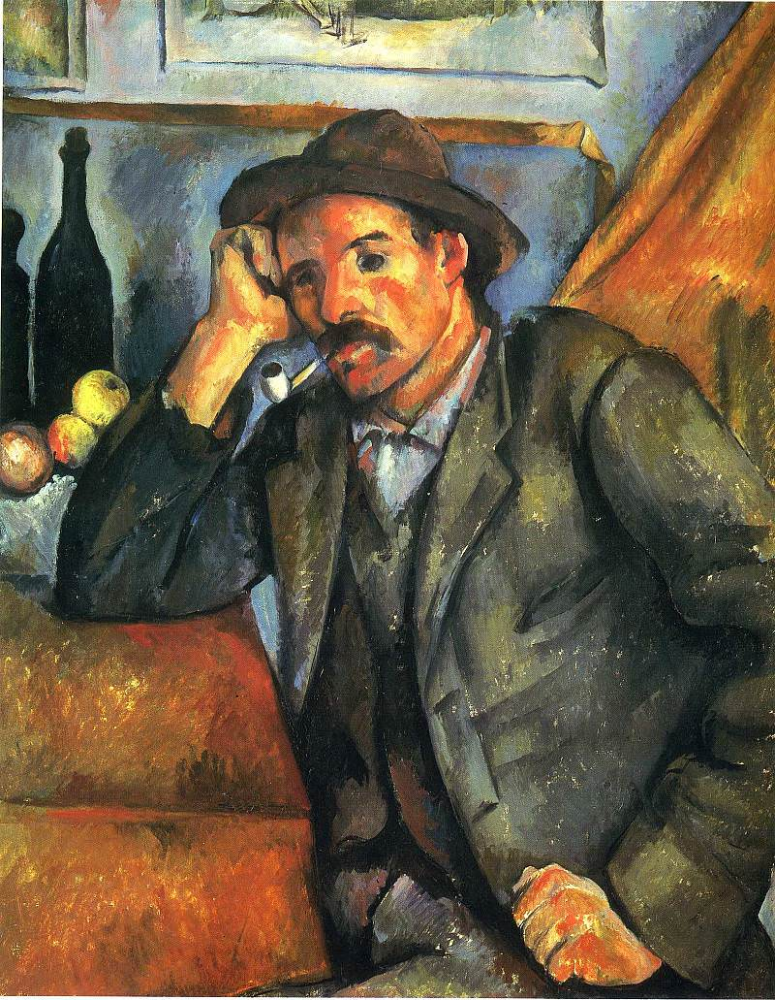

[🏠 Home](../../index.md)

# February 25

## 🧑‍🎨 Painting of the day

[Paul Cezanne](https://en.wikipedia.org/wiki/Paul_Cézanne) (Post-Impressionism)

<button class="btn btn-success"
onclick=" window.open('https://lens.google.com/uploadbyurl?url=https://iretes.github.io/one-a-day/data/img/Paul_Cezanne_4.jpg','_blank')">
Search with Google Lens
</button>

## 🎼 Song of the day

> *Blue Suede Shoes*
by Carl Perkins

 Written by Perkins.

Released in Feb , 1956.

<button class="btn btn-success"
onclick=" window.open('http://www.youtube.com/search?q=Blue Suede Shoes by Carl Perkins','_blank')">
Search on YouTube
</button>

## 🏛️ UNESCO heritage site of the day

> *Rock-Art Sites of Tadrart Acacus*, Libya

On the borders of Tassili N'Ajjer in Algeria, also a World Heritage site, this rocky massif has thousands of cave paintings in very different styles, dating from 12,000 B.C. to A.D. 100. They reflect marked changes in the fauna and flora, and also the different ways of life of the populations that succeeded one another in this region of the Sahara.

<button class="btn btn-success"
onclick=" window.open('http://www.google.com/search?q=Rock-Art Sites of Tadrart Acacus','_blank')">
Search on Google
</button>

## 🗺️ Place of the day

<iframe
src="https://www.mapcrunch.com"
name="mapcrunch"
width="500"
height="500"
allowTransparency="true"
scrolling="no"
frameborder="0"
>
</iframe>
## 🎨 Color of the day

> *[Outer space (Crayola)](https://en.wikipedia.org/wiki/Shades_of_black#Outer_space_(Crayola))*

&#9632;

## 🌿 Plant of the day

> *trailing bittersweet*

<button class="btn btn-success"
onclick=" window.open('http://www.google.com/search?q=trailing bittersweet','_blank')">
Search on Google
</button>

## 🧑‍🔬 Scientific discovery of the day

> *2001: The first draft of the Human Genome Project is published.*

<button class="btn btn-success"
onclick=" window.open('http://www.google.com/search?q=2001: The first draft of the Human Genome Project is published.','_blank')"> 
Search on Google
</button>

## 💭 Philosophical concept of the day

> *[Last man](https://en.wikipedia.org/wiki/Last_man)*

## 🗣️ Saying of the day

> *Mal de mer*

Seasickness.
