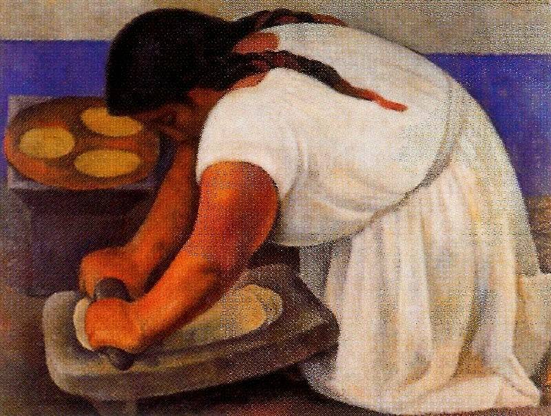

[🏠 Home](../../index.md)

# February 26

## 🧑‍🎨 Painting of the day

[Diego Rivera](http://en.wikipedia.org/wiki/Diego_Rivera) (Social Realism, Muralism)

<button class="btn btn-success"
onclick=" window.open('https://lens.google.com/uploadbyurl?url=https://iretes.github.io/one-a-day/data/img/Diego_Rivera_3.jpg','_blank')">
Search with Google Lens
</button>

## 🎼 Song of the day

> *Good Golly*
by Little Richard

 Written by Robert "Bumps" Blackwell, John Marascalco.

Released in Feb. , 1958.

<button class="btn btn-success"
onclick=" window.open('http://www.youtube.com/search?q=Good Golly by Little Richard','_blank')">
Search on YouTube
</button>

## 🏛️ UNESCO heritage site of the day

> *Tchogha Zanbil*, Iran (Islamic Republic of)

The ruins of the holy city of the Kingdom of Elam, surrounded by three huge concentric walls, are found at Tchogha Zanbil. Founded c. 1250 B.C., the city remained unfinished after it was invaded by Ashurbanipal, as shown by the thousands of unused bricks left at the site.

<button class="btn btn-success"
onclick=" window.open('http://www.google.com/search?q=Tchogha Zanbil','_blank')">
Search on Google
</button>

## 🗺️ Place of the day

<iframe
src="https://www.mapcrunch.com"
name="mapcrunch"
width="500"
height="500"
allowTransparency="true"
scrolling="no"
frameborder="0"
>
</iframe>
## 🎨 Color of the day

> *[Drab dark brown](https://en.wikipedia.org/wiki/Pantone_448_C)*

&#9632;

## 🌿 Plant of the day

> *zedoary*

<button class="btn btn-success"
onclick=" window.open('http://www.google.com/search?q=zedoary','_blank')">
Search on Google
</button>

## 🧑‍🔬 Scientific discovery of the day

> *190 BC: Magic squares appear in China. The theory of magic squares can be considered the first example of a vector space.*

<button class="btn btn-success"
onclick=" window.open('http://www.google.com/search?q=190 BC: Magic squares appear in China. The theory of magic squares can be considered the first example of a vector space.','_blank')">
Search on Google
</button>

## 💭 Philosophical concept of the day

> *[Integral yoga](https://en.wikipedia.org/wiki/Integral_yoga)*

## 🗣️ Saying of the day

> *Tanstaafl - (there's no such thing as a free lunch)*

The economic theory, and also the lay opinion, that whatever goods and services are provided, they must be paid for by someone - that is, you don't get something for nothing. The phrase is also known by the acronym of 'there ain't no such thing as a free lunch' - tanstaafl. 
