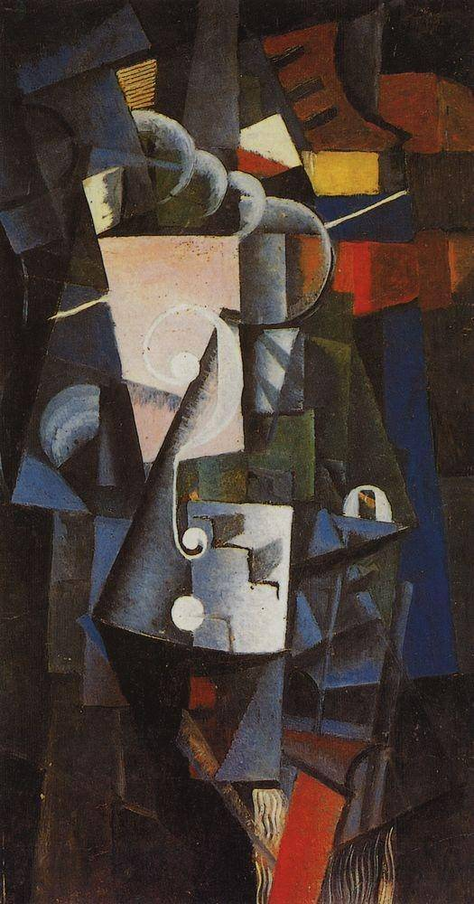

[🏠 Home](../../index.md)

# February 28

## 🧑‍🎨 Painting of the day

[Kazimir Malevich](http://en.wikipedia.org/wiki/Kazimir_Malevich) (Suprematism)

<button class="btn btn-success"
onclick=" window.open('https://lens.google.com/uploadbyurl?url=https://iretes.github.io/one-a-day/data/img/Kazimir_Malevich_7.jpg','_blank')">
Search with Google Lens
</button>

## 🎼 Song of the day

> *Blitzkrieg Bop*
by Ramones

 Written by The Ramones.

Released in May , 1976.

<button class="btn btn-success"
onclick=" window.open('http://www.youtube.com/search?q=Blitzkrieg Bop by Ramones','_blank')">
Search on YouTube
</button>

## 🏛️ UNESCO heritage site of the day

> *Air and Ténéré Natural Reserves*, Niger

This is the largest protected area in Africa, covering some 7.7 million ha, though the area considered a protected sanctuary constitutes only one-sixth of the total area. It includes the volcanic rock mass of the Aïr, a small Sahelian pocket, isolated as regards its climate and flora and fauna, and situated in the Saharan desert of Ténéré. The reserves boast an outstanding variety of landscapes, plant species and wild animals.

<button class="btn btn-success"
onclick=" window.open('http://www.google.com/search?q=Air and Ténéré Natural Reserves','_blank')">
Search on Google
</button>

## 🗺️ Place of the day

<iframe
src="https://www.mapcrunch.com"
name="mapcrunch"
width="500"
height="500"
allowTransparency="true"
scrolling="no"
frameborder="0"
>
</iframe>
## 🎨 Color of the day

> *[Bronze](https://en.wikipedia.org/wiki/Bronze_(color))*

&#9632;

## 🌿 Plant of the day

> *way bread*

<button class="btn btn-success"
onclick=" window.open('http://www.google.com/search?q=way bread','_blank')">
Search on Google
</button>

## 🧑‍🔬 Scientific discovery of the day

> *628: Brahmagupta writes down Brahmagupta's identity, an important lemma in the theory of Pell's equation.*

<button class="btn btn-success"
onclick=" window.open('http://www.google.com/search?q=628: Brahmagupta writes down Brahmagupta s identity, an important lemma in the theory of Pell s equation.','_blank')">
Search on Google
</button>

## 💭 Philosophical concept of the day

> *[Eudaimonia](https://en.wikipedia.org/wiki/Eudaimonia)*

## 🗣️ Saying of the day

> *House divided against itself cannot stand - A *

Literal meaning (house meaning household).
