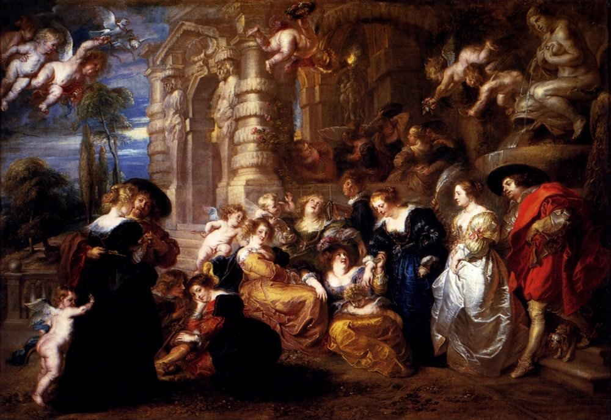

[🏠 Home](../../index.md)

# February 29

## 🧑‍🎨 Painting of the day

[Peter Paul Rubens](http://en.wikipedia.org/wiki/Peter_Paul_Rubens) (Baroque)

<button class="btn btn-success"
onclick=" window.open('https://lens.google.com/uploadbyurl?url=https://iretes.github.io/one-a-day/data/img/Peter_Paul_Rubens_4.jpg','_blank')">
Search with Google Lens
</button>

## 🎼 Song of the day

> *Suspicious Minds*
by Elvis Presley

 Written by Mark James.

Released in Sept. , 1969.

<button class="btn btn-success"
onclick=" window.open('http://www.youtube.com/search?q=Suspicious Minds by Elvis Presley','_blank')">
Search on YouTube
</button>

## 🏛️ UNESCO heritage site of the day

> *Historic Centre of Siena*, Italy

Siena is the embodiment of a medieval city. Its inhabitants pursued their rivalry with Florence right into the area of urban planning. Throughout the centuries, they preserved their city's Gothic appearance, acquired between the 12th and 15th centuries. During this period the work of Duccio, the Lorenzetti brothers and Simone Martini was to influence the course of Italian and, more broadly, European art. The whole city of Siena, built around the Piazza del Campo, was devised as a work of art that blends into the surrounding landscape.

<button class="btn btn-success"
onclick=" window.open('http://www.google.com/search?q=Historic Centre of Siena','_blank')">
Search on Google
</button>

## 🗺️ Place of the day

<iframe
src="https://www.mapcrunch.com"
name="mapcrunch"
width="500"
height="500"
allowTransparency="true"
scrolling="no"
frameborder="0"
>
</iframe>
## 🎨 Color of the day

> *[UP Forest green](https://en.wikipedia.org/wiki/Shades_of_green#UP_forest_green)*

&#9632;

## 🌿 Plant of the day

> *oak tree quercus*

<button class="btn btn-success"
onclick=" window.open('http://www.google.com/search?q=oak tree quercus','_blank')">
Search on Google
</button>

## 🧑‍🔬 Scientific discovery of the day

> *1800 BC: The Middle Kingdom of Egypt develops Egyptian fraction notation.*

<button class="btn btn-success"
onclick=" window.open('http://www.google.com/search?q=1800 BC: The Middle Kingdom of Egypt develops Egyptian fraction notation.','_blank')">
Search on Google
</button>

## 💭 Philosophical concept of the day

> *[Innocence](https://en.wikipedia.org/wiki/Innocence)*

## 🗣️ Saying of the day

> *Upside down*

Turned so that the upper surface becomes the lower. 
