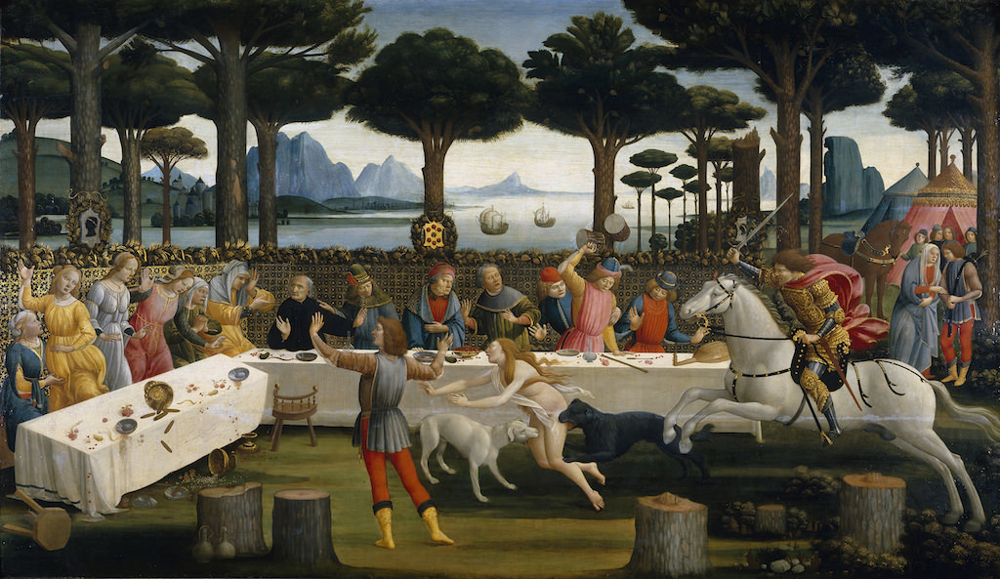

[🏠 Home](../../index.md)

# February 4

## 🧑‍🎨 Painting of the day

[Sandro Botticelli](http://en.wikipedia.org/wiki/Sandro_Botticelli) (Early Renaissance)

<button class="btn btn-success"
onclick=" window.open('https://lens.google.com/uploadbyurl?url=https://iretes.github.io/one-a-day/data/img/Sandro_Botticelli_7.jpg','_blank')">
Search with Google Lens
</button>

## 🎼 Song of the day

> *Light My Fire*
by The Doors

 Written by Robby Krieger, John Densmore, Jim Morrison, Ray Manzarek.

Released in June, 1967.

<button class="btn btn-success"
onclick=" window.open('http://www.youtube.com/search?q=Light My Fire by The Doors','_blank')">
Search on YouTube
</button>

## 🏛️ UNESCO heritage site of the day

> *Bahá’i Holy Places in Haifa and the Western Galilee*, Israel

The Bah&aacute;&rsquo;i Holy Places in Haifa and Western Galilee are inscribed for their profound spiritual meaning and the testimony they bear to the strong tradition of pilgrimage in the Bah&aacute;&rsquo;i faith. The property includes the two most holy places in the Bah&aacute;&rsquo;&iacute; religion associated with the founders, the Shrine of Bah&aacute;&rsquo;u&rsquo;ll&aacute;h in Acre and the Shrine of the B&aacute;b in Haifa, together with their surrounding gardens, associated buildings and monuments. These two shrines are part of a larger complex of buildings, monuments and sites at seven distinct locations in Haifa and Western Galilee that are visited as part of the Bah&aacute;&rsquo;i pilgrimage.

<button class="btn btn-success"
onclick=" window.open('http://www.google.com/search?q=Bahá’i Holy Places in Haifa and the Western Galilee','_blank')">
Search on Google
</button>

## 🗺️ Place of the day

<iframe
src="https://www.mapcrunch.com"
name="mapcrunch"
width="500"
height="500"
allowTransparency="true"
scrolling="no"
frameborder="0"
>
</iframe>
## 🎨 Color of the day

> *[UA red](https://en.wikipedia.org/wiki/University_of_Arizona#School_colors)*

&#9632;

## 🌿 Plant of the day

> *rocket cress*

<button class="btn btn-success"
onclick=" window.open('http://www.google.com/search?q=rocket cress','_blank')">
Search on Google
</button>

## 🧑‍🔬 Scientific discovery of the day

> *1638: Galileo Galilei: laws of falling bodies.*

<button class="btn btn-success"
onclick=" window.open('http://www.google.com/search?q=1638: Galileo Galilei: laws of falling bodies.','_blank')">
Search on Google
</button>

## 💭 Philosophical concept of the day

> *[Logos](https://en.wikipedia.org/wiki/Logos)*

## 🗣️ Saying of the day

> *Year dot - The*

A very long time ago; too long ago to be dated.

## 🏳️‍🌈 International day

International Day of Human Fraternity.