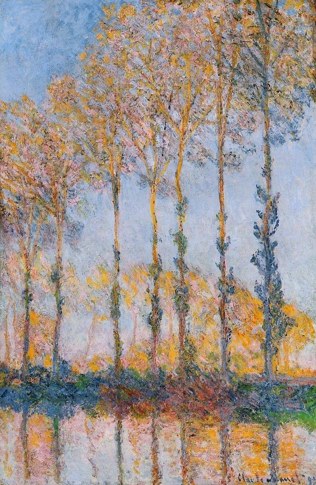

[🏠 Home](../../index.md)

# February 8

## 🧑‍🎨 Painting of the day

[Claude Monet](http://en.wikipedia.org/wiki/Claude_Monet) (Impressionism)

<button class="btn btn-success"
onclick=" window.open('https://lens.google.com/uploadbyurl?url=https://iretes.github.io/one-a-day/data/img/Claude_Monet_3.jpg','_blank')">
Search with Google Lens
</button>

## 🎼 Song of the day

> *That'll Be the Day*
by Buddy Holly and the Crickets

 Written by Jerry Allison, Holly, Norman Petty.

Released in May, 1957.

<button class="btn btn-success"
onclick=" window.open('http://www.youtube.com/search?q=That ll Be the Day by Buddy Holly and the Crickets','_blank')">
Search on YouTube
</button>

## 🏛️ UNESCO heritage site of the day

> *Cerrado Protected Areas: Chapada dos Veadeiros and Emas National Parks*, Brazil

The two sites included in the designation contain flora and fauna and key habitats that characterize the Cerrado – one of the world’s oldest and most diverse tropical ecosystems. For millennia, these sites have served as refuge for several species during periods of climate change and will be vital for maintaining the biodiversity of the Cerrado region during future climate fluctuations.

<button class="btn btn-success"
onclick=" window.open('http://www.google.com/search?q=Cerrado Protected Areas: Chapada dos Veadeiros and Emas National Parks','_blank')">
Search on Google
</button>

## 🗺️ Place of the day

<iframe
src="https://www.mapcrunch.com"
name="mapcrunch"
width="500"
height="500"
allowTransparency="true"
scrolling="no"
frameborder="0"
>
</iframe>
## 🎨 Color of the day

> *[Paris Green](https://en.wikipedia.org/wiki/Paris_green)*

&#9632;

## 🌿 Plant of the day

> *travellers joy*

<button class="btn btn-success"
onclick=" window.open('http://www.google.com/search?q=travellers joy','_blank')">
Search on Google
</button>

## 🧑‍🔬 Scientific discovery of the day

> *350 BC - 50 BC: Clay tablets from (possibly Hellenistic-era) Babylon describe the mean speed theorem.*

<button class="btn btn-success"
onclick=" window.open('http://www.google.com/search?q=350 BC - 50 BC: Clay tablets from (possibly Hellenistic-era) Babylon describe the mean speed theorem.','_blank')">
Search on Google
</button>

## 💭 Philosophical concept of the day

> *[Power](https://en.wikipedia.org/wiki/Power_(social_and_political))*

## 🗣️ Saying of the day

> *Piss and vinegar - Full of *

Rowdy, boisterous, full of youthful energy. 
