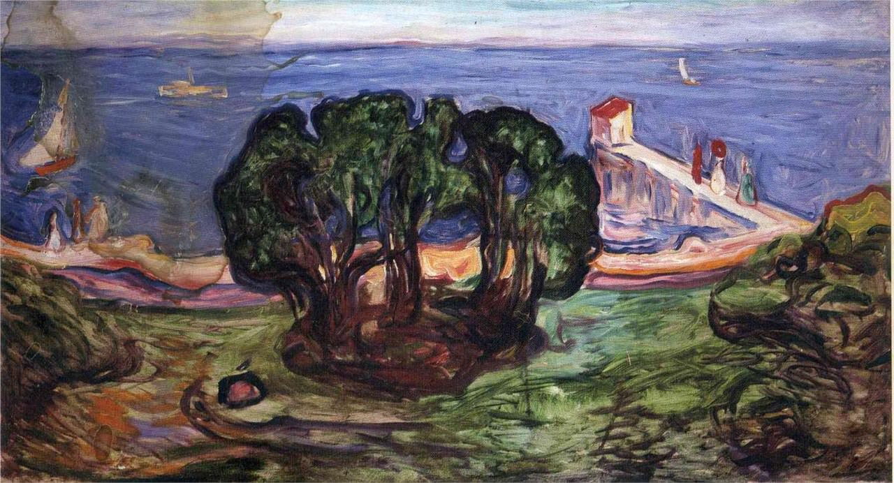

[🏠 Home](../../index.md)

# January 1

## 🧑‍🎨 Painting of the day

[Edvard Munch](https://en.wikipedia.org/wiki/Edvard_Munch) (Symbolism, Expressionism)

<button class="btn btn-success"
onclick=" window.open('https://lens.google.com/uploadbyurl?url=https://iretes.github.io/one-a-day/data/img/Edvard_Munch_7.jpg','_blank')">
Search with Google Lens
</button>

## 🎼 Song of the day

> *Like a Rolling Stone*
by Bob Dylan

 Written by Dylan.

Released in July, 1965.

<button class="btn btn-success"
onclick=" window.open('http://www.youtube.com/search?q=Like a Rolling Stone by Bob Dylan','_blank')">
Search on YouTube
</button>

## 🏛️ UNESCO heritage site of the day

> *Macquarie Island*, Australia

Macquarie Island (34 km long x 5 km wide) is an oceanic island in the Southern Ocean, lying 1,500 km south-east of Tasmania and approximately halfway between Australia and the Antarctic continent. The island is the exposed crest of the undersea Macquarie Ridge, raised to its present position where the Indo-Australian tectonic plate meets the Pacific plate. It is a site of major geoconservation significance, being the only place on earth where rocks from the earth’s mantle (6 km below the ocean floor) are being actively exposed above sea-level. These unique exposures include excellent examples of pillow basalts and other extrusive rocks.

<button class="btn btn-success"
onclick=" window.open('http://www.google.com/search?q=Macquarie Island','_blank')">
Search on Google
</button>

## 🗺️ Place of the day

<iframe
src="https://www.mapcrunch.com"
name="mapcrunch"
width="500"
height="500"
allowTransparency="true"
scrolling="no"
frameborder="0"
>
</iframe>
## 🎨 Color of the day

> *[Snow](https://en.wikipedia.org/wiki/Shades_of_white#Snow)*

&#9632;

## 🌿 Plant of the day

> *isle of man cabbage*

<button class="btn btn-success"
onclick=" window.open('http://www.google.com/search?q=isle of man cabbage','_blank')">
Search on Google
</button>

## 🧑‍🔬 Scientific discovery of the day

> *1267: Roger Bacon publishes his Opus Majus, compiling translated Classical Greek, and Arabic works on mathematics, optics, and alchemy into a volume, and details his methods for evaluating the theories, particularly those of Ptolemy's 2nd century Optics, and his findings on the production of lenses, asserting “theories supplied by reason should be verified by sensory data, aided by instruments, and corroborated by trustworthy witnesses", in a precursor to the peer reviewed scientific method.*

<button class="btn btn-success"
onclick=" window.open('http://www.google.com/search?q=1267: Roger Bacon publishes his Opus Majus, compiling translated Classical Greek, and Arabic works on mathematics, optics, and alchemy into a volume, and details his methods for evaluating the theories, particularly those of Ptolemy s 2nd century Optics, and his findings on the production of lenses, asserting “theories supplied by reason should be verified by sensory data, aided by instruments, and corroborated by trustworthy witnesses, in a precursor to the peer reviewed scientific method.','_blank')"> 
Search on Google
</button>

## 💭 Philosophical concept of the day

> *[Ren](https://en.wikipedia.org/wiki/Ren_(Confucianism))*

## 🗣️ Saying of the day

> *Walk the walk*

Back up one's talk with action. 
