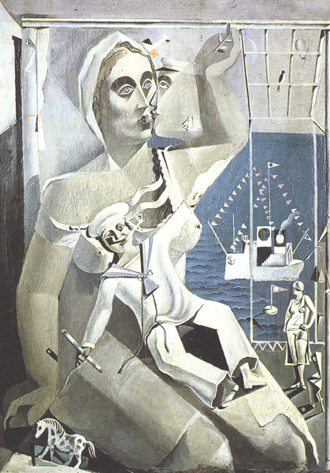

[🏠 Home](../../index.md)

# January 11

## 🧑‍🎨 Painting of the day

[Salvador Dali](http://en.wikipedia.org/wiki/Salvador_Dalí) (Surrealism)

<button class="btn btn-success"
onclick=" window.open('https://lens.google.com/uploadbyurl?url=https://iretes.github.io/one-a-day/data/img/Salvador_Dali_1.jpg','_blank')">
Search with Google Lens
</button>

## 🎼 Song of the day

> *My Generation*
by The Who

 Written by Pete Townshend.

Released in Nov, 1965.

<button class="btn btn-success"
onclick=" window.open('http://www.youtube.com/search?q=My Generation by The Who','_blank')">
Search on YouTube
</button>

## 🏛️ UNESCO heritage site of the day

> *Area de Conservación Guanacaste*, Costa Rica

The Area de Conservación Guanacaste (inscribed in 1999), was extended with the addition of a 15,000 ha private property, St Elena. It contains important natural habitats for the conservation of biological diversity, including the best dry forest habitats from Central America to northern Mexico and key habitats for endangered or rare plant and animal species. The site demonstrates significant ecological processes in both its terrestrial and marine-coastal environments.

<button class="btn btn-success"
onclick=" window.open('http://www.google.com/search?q=Area de Conservación Guanacaste','_blank')">
Search on Google
</button>

## 🗺️ Place of the day

<iframe
src="https://www.mapcrunch.com"
name="mapcrunch"
width="500"
height="500"
allowTransparency="true"
scrolling="no"
frameborder="0"
>
</iframe>
## 🎨 Color of the day

> *[Spanish sky blue](https://en.wikipedia.org/wiki/Sky_blue#Spanish_sky_blue)*

&#9632;

## 🌿 Plant of the day

> *tulip*

<button class="btn btn-success"
onclick=" window.open('http://www.google.com/search?q=tulip','_blank')">
Search on Google
</button>

## 🧑‍🔬 Scientific discovery of the day

> *2022: The complete human genome is sequenced.*

<button class="btn btn-success"
onclick=" window.open('http://www.google.com/search?q=2022: The complete human genome is sequenced.','_blank')">
Search on Google
</button>

## 💭 Philosophical concept of the day

> *[Eroticism](https://en.wikipedia.org/wiki/Eroticism)*

## 🗣️ Saying of the day

> *Between a rock and a hard place*

In difficulty, faced with a choice between two unsatisfactory options.
