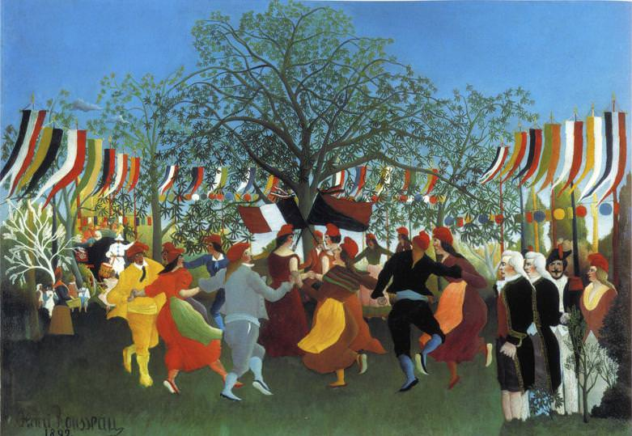

[🏠 Home](../../index.md)

# January 12

## 🧑‍🎨 Painting of the day

[Henri Rousseau](https://en.wikipedia.org/wiki/Henri_Rousseau) (Primitivism)

<button class="btn btn-success"
onclick=" window.open('https://lens.google.com/uploadbyurl?url=https://iretes.github.io/one-a-day/data/img/Henri_Rousseau_1.jpg','_blank')">
Search with Google Lens
</button>

## 🎼 Song of the day

> *A Change Is Gonna Come*
by Sam Cooke

 Written by Cooke.

Released in Dec, 1964.

<button class="btn btn-success"
onclick=" window.open('http://www.youtube.com/search?q=A Change Is Gonna Come by Sam Cooke','_blank')">
Search on YouTube
</button>

## 🏛️ UNESCO heritage site of the day

> *Kluane / Wrangell-St. Elias / Glacier Bay / Tatshenshini-Alsek*, Canada,United States of America

These parks comprise an impressive complex of glaciers and high peaks on both sides of the border between Canada (Yukon Territory and British Columbia) and the United States (Alaska). The spectacular natural landscapes are home to many grizzly bears, caribou and Dall's sheep. The site contains the largest non-polar icefield in the world.

<button class="btn btn-success"
onclick=" window.open('http://www.google.com/search?q=Kluane / Wrangell-St. Elias / Glacier Bay / Tatshenshini-Alsek','_blank')">
Search on Google
</button>

## 🗺️ Place of the day

<iframe
src="https://www.mapcrunch.com"
name="mapcrunch"
width="500"
height="500"
allowTransparency="true"
scrolling="no"
frameborder="0"
>
</iframe>
## 🎨 Color of the day

> *[OU Crimson red](https://en.wikipedia.org/wiki/Shades_of_red#OU_crimson)*

&#9632;

## 🌿 Plant of the day

> *goodding willow*

<button class="btn btn-success"
onclick=" window.open('http://www.google.com/search?q=goodding willow','_blank')">
Search on Google
</button>

## 🧑‍🔬 Scientific discovery of the day

> *1550 BC: The Rhind Mathematical Papyrus (a copy of an older Middle Kingdom text) contains the first documented instance of inscribing a polygon (in this case, an octagon) into a circle to estimate the value of π.*

<button class="btn btn-success"
onclick=" window.open('http://www.google.com/search?q=1550 BC: The Rhind Mathematical Papyrus (a copy of an older Middle Kingdom text) contains the first documented instance of inscribing a polygon (in this case, an octagon) into a circle to estimate the value of π.','_blank')"> 
Search on Google
</button>

## 💭 Philosophical concept of the day

> *[Rajas](https://en.wikipedia.org/wiki/Rajas)*

## 🗣️ Saying of the day

> *Brook no truck with*

To reject or to have nothing to do with.
