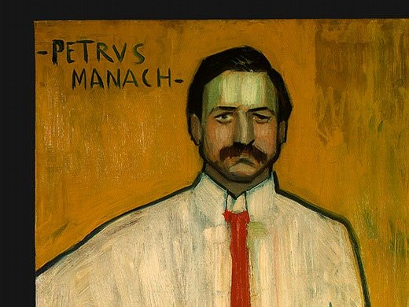

[🏠 Home](../../index.md)

# January 14

## 🧑‍🎨 Painting of the day

[Pablo Picasso](http://en.wikipedia.org/wiki/Pablo_Picasso) (Cubism)

<button class="btn btn-success"
onclick=" window.open('https://lens.google.com/uploadbyurl?url=https://iretes.github.io/one-a-day/data/img/Pablo_Picasso_4.jpg','_blank')">
Search with Google Lens
</button>

## 🎼 Song of the day

> *Blowin' in the Wind*
by Bob Dylan

 Written by Dylan.

Released in May, 1963.

<button class="btn btn-success"
onclick=" window.open('http://www.youtube.com/search?q=Blowin  in the Wind by Bob Dylan','_blank')">
Search on YouTube
</button>

## 🏛️ UNESCO heritage site of the day

> *Royal Building of <i>Mafra</i> – Palace, Basilica, Convent, <i>Cerco</i> Garden and Hunting Park (<i>Tapada</i>)*, Portugal

Located 30 km northwest of Lisbon, the property was conceived by King João V in 1711 as a tangible representation of his conception of the monarchy and the State. This imposing quadrangular building houses the king’s and queen's palaces, the royal chapel, shaped like a Roman baroque basilica, a Franciscan monastery and a library containing 36,000 volumes. The complex is completed by the <em>Cerco</em> garden, with its geometric layout, and the royal hunting park (<em>Tapada</em>). The Royal <em>Mafra</em> Building is one of the most remarkable works undertaken by King João V, which illustrates the power and reach of the Portuguese Empire. João V adopted Roman and Italian baroque architectural and artistic models and commissioned works of art that make <em>Mafra</em> an exceptional example of Italian Baroque.

<button class="btn btn-success"
onclick=" window.open('http://www.google.com/search?q=Royal Building of <i>Mafra</i> – Palace, Basilica, Convent, <i>Cerco</i> Garden and Hunting Park (<i>Tapada</i>)','_blank')">
Search on Google
</button>

## 🗺️ Place of the day

<iframe
src="https://www.mapcrunch.com"
name="mapcrunch"
width="500"
height="500"
allowTransparency="true"
scrolling="no"
frameborder="0"
>
</iframe>
## 🎨 Color of the day

> *[Phthalo blue](https://en.wikipedia.org/wiki/Phthalocyanine_Blue_BN)*

&#9632;

## 🌿 Plant of the day

> *weeping birch*

<button class="btn btn-success"
onclick=" window.open('http://www.google.com/search?q=weeping birch','_blank')">
Search on Google
</button>

## 🧑‍🔬 Scientific discovery of the day

> *1848: Lord Kelvin: absolute zero.*

<button class="btn btn-success"
onclick=" window.open('http://www.google.com/search?q=1848: Lord Kelvin: absolute zero.','_blank')">
Search on Google
</button>

## 💭 Philosophical concept of the day

> *[Law of thought](https://en.wikipedia.org/wiki/Law_of_thought)*

## 🗣️ Saying of the day

> *Make haste*

Act quickly.
