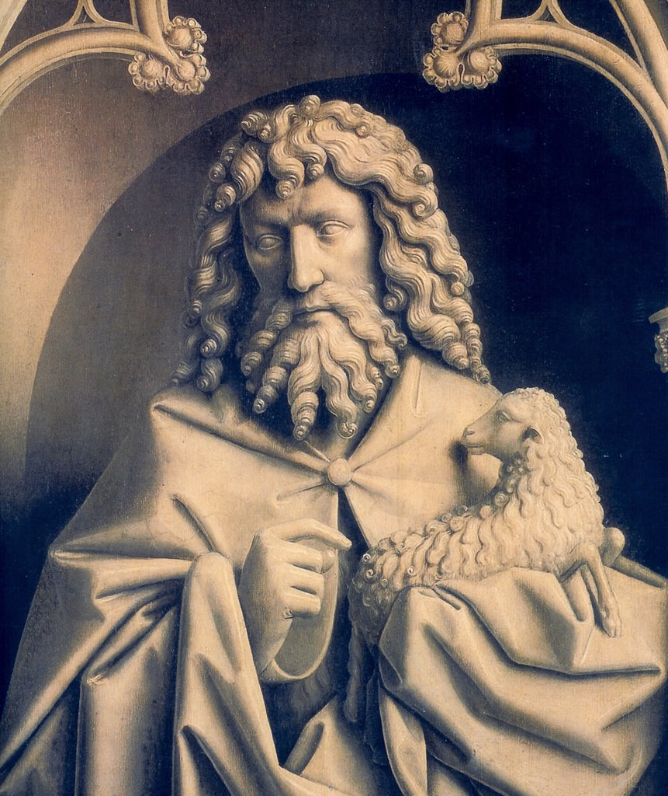

[🏠 Home](../../index.md)

# January 16

## 🧑‍🎨 Painting of the day

[Jan van Eyck](http://en.wikipedia.org/wiki/Jan_van_Eyck) (Northern Renaissance)

<button class="btn btn-success"
onclick=" window.open('https://lens.google.com/uploadbyurl?url=https://iretes.github.io/one-a-day/data/img/Jan_van_Eyck_5.jpg','_blank')">
Search with Google Lens
</button>

## 🎼 Song of the day

> *I Want to Hold Your Hand*
by The Beatles

 Written by John Lennon, Paul McCartney.

Released in Dec, 1963.

<button class="btn btn-success"
onclick=" window.open('http://www.youtube.com/search?q=I Want to Hold Your Hand by The Beatles','_blank')">
Search on YouTube
</button>

## 🏛️ UNESCO heritage site of the day

> *Dougga / Thugga*, Tunisia

Before the Roman annexation of Numidia, the town of Thugga, built on an elevated site overlooking a fertile plain, was the capital of an important Libyco-Punic state. It flourished under Roman and Byzantine rule, but declined in the Islamic period. The impressive ruins that are visible today give some idea of the resources of a small Roman town on the fringes of the empire.

<button class="btn btn-success"
onclick=" window.open('http://www.google.com/search?q=Dougga / Thugga','_blank')">
Search on Google
</button>

## 🗺️ Place of the day

<iframe
src="https://www.mapcrunch.com"
name="mapcrunch"
width="500"
height="500"
allowTransparency="true"
scrolling="no"
frameborder="0"
>
</iframe>
## 🎨 Color of the day

> *[Cadet blue](https://en.wikipedia.org/wiki/Cadet_grey#Cadet_blue)*

&#9632;

## 🌿 Plant of the day

> *hairy bittercress*

<button class="btn btn-success"
onclick=" window.open('http://www.google.com/search?q=hairy bittercress','_blank')">
Search on Google
</button>

## 🧑‍🔬 Scientific discovery of the day

> *1996: Roslin Institute: Dolly the sheep was cloned.*

<button class="btn btn-success"
onclick=" window.open('http://www.google.com/search?q=1996: Roslin Institute: Dolly the sheep was cloned.','_blank')">
Search on Google
</button>

## 💭 Philosophical concept of the day

> *[Integral theory](https://en.wikipedia.org/wiki/Integral_theory_(Ken_Wilber))*

## 🗣️ Saying of the day

> *Country bumpkin*

An awkward, unsophisticated rustic; a clown
