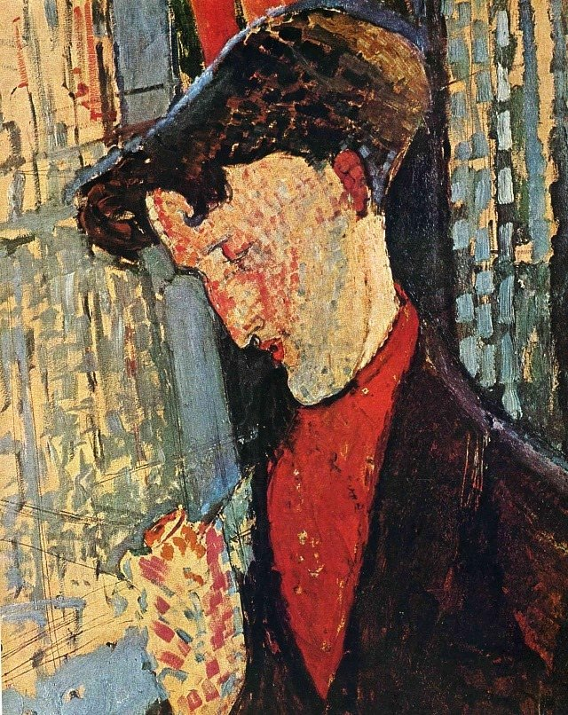

[🏠 Home](../../index.md)

# January 19

## 🧑‍🎨 Painting of the day

[Amedeo Modigliani](http://en.wikipedia.org/wiki/Amedeo_Modigliani) (Expressionism)

<button class="btn btn-success"
onclick=" window.open('https://lens.google.com/uploadbyurl?url=https://iretes.github.io/one-a-day/data/img/Amedeo_Modigliani_2.jpg','_blank')">
Search with Google Lens
</button>

## 🎼 Song of the day

> *Hound Dog*
by Elvis Presley

 Written by Jerry Leiber, Mike Stoller.

Released in July, 1956.

<button class="btn btn-success"
onclick=" window.open('http://www.youtube.com/search?q=Hound Dog by Elvis Presley','_blank')">
Search on YouTube
</button>

## 🏛️ UNESCO heritage site of the day

> *Bolgar Historical and Archaeological Complex*, Russian Federation

This property lies on the shores of the Volga River, south of its confluence with the River Kama, and south of the capital of Tatarstan, Kazan. It contains evidence of the medieval city of Bolgar, an early settlement of the civilization of Volga-Bolgars, which existed between the 7th and 15th centuries AD, and was the first capital of the Golden Horde in the 13th century. Bolgar represents the historical cultural exchanges and transformations of Eurasia over several centuries that played a pivotal role in the formation of civilizations, customs and cultural traditions. The property provides remarkable evidence of historic continuity and cultural diversity. It is a symbolic reminder of the acceptance of Islam by the Volga-Bolgars in AD 922 and remains a sacred pilgrimage destination to the Tatar Muslims.

<button class="btn btn-success"
onclick=" window.open('http://www.google.com/search?q=Bolgar Historical and Archaeological Complex','_blank')">
Search on Google
</button>

## 🗺️ Place of the day

<iframe
src="https://www.mapcrunch.com"
name="mapcrunch"
width="500"
height="500"
allowTransparency="true"
scrolling="no"
frameborder="0"
>
</iframe>
## 🎨 Color of the day

> *[Laser lemon](https://en.wikipedia.org/wiki/Lemon_(color)#Laser_lemon)*

&#9632;

## 🌿 Plant of the day

> *goose tongue*

<button class="btn btn-success"
onclick=" window.open('http://www.google.com/search?q=goose tongue','_blank')">
Search on Google
</button>

## 🧑‍🔬 Scientific discovery of the day

> *1564: Gerolamo Cardano is the first to produce a systematic treatment of probability.*

<button class="btn btn-success"
onclick=" window.open('http://www.google.com/search?q=1564: Gerolamo Cardano is the first to produce a systematic treatment of probability.','_blank')"> 
Search on Google
</button>

## 💭 Philosophical concept of the day

> *[Meaning of life](https://en.wikipedia.org/wiki/Meaning_of_life)*

## 🗣️ Saying of the day

> *Chop and change*

To  change one's mind or action again and again.
