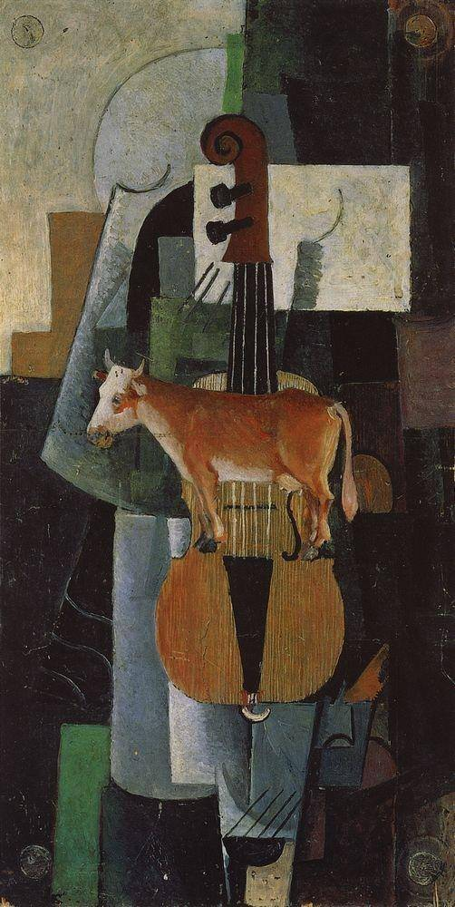

[🏠 Home](../../index.md)

# January 2

## 🧑‍🎨 Painting of the day

[Kazimir Malevich](http://en.wikipedia.org/wiki/Kazimir_Malevich) (Suprematism)

<button class="btn btn-success"
onclick=" window.open('https://lens.google.com/uploadbyurl?url=https://iretes.github.io/one-a-day/data/img/Kazimir_Malevich_4.jpg','_blank')">
Search with Google Lens
</button>

## 🎼 Song of the day

> *(I Can't Get No) Satisfaction'*
by The Rolling Stones

 Written by Mick Jagger, Keith Richards.

Released in May, 1965.

<button class="btn btn-success"
onclick=" window.open('http://www.youtube.com/search?q=(I Can t Get No) Satisfaction  by The Rolling Stones','_blank')">
Search on YouTube
</button>

## 🏛️ UNESCO heritage site of the day

> *Historic Quarter of the Seaport City of Valparaíso*, Chile

The colonial city of Valpara&iacute;so presents an excellent example of late 19th-century urban and architectural development in Latin America. In its natural amphitheatre-like setting, the city is characterized by a vernacular urban fabric adapted to the hillsides that are dotted with a great variety of church spires. It contrasts with the geometrical layout utilized in the plain. The city has well preserved its interesting early industrial infrastructures, such as the numerous &lsquo;elevators&rsquo; on the steep hillsides.

<button class="btn btn-success"
onclick=" window.open('http://www.google.com/search?q=Historic Quarter of the Seaport City of Valparaíso','_blank')">
Search on Google
</button>

## 🗺️ Place of the day

<iframe
src="https://www.mapcrunch.com"
name="mapcrunch"
width="500"
height="500"
allowTransparency="true"
scrolling="no"
frameborder="0"
>
</iframe>
## 🎨 Color of the day

> *[Lime green](https://en.wikipedia.org/wiki/Lime_(color)#Lime_green)*

&#9632;

## 🌿 Plant of the day

> *hemp*

<button class="btn btn-success"
onclick=" window.open('http://www.google.com/search?q=hemp','_blank')">
Search on Google
</button>

## 🧑‍🔬 Scientific discovery of the day

> *4th century BC: Menaechmus develops co-ordinate geometry.*

<button class="btn btn-success"
onclick=" window.open('http://www.google.com/search?q=4th century BC: Menaechmus develops co-ordinate geometry.','_blank')">
Search on Google
</button>

## 💭 Philosophical concept of the day

> *[Mercy](https://en.wikipedia.org/wiki/Mercy)*

## 🗣️ Saying of the day

> *Cotton on to*

To get to know or understand something. 
