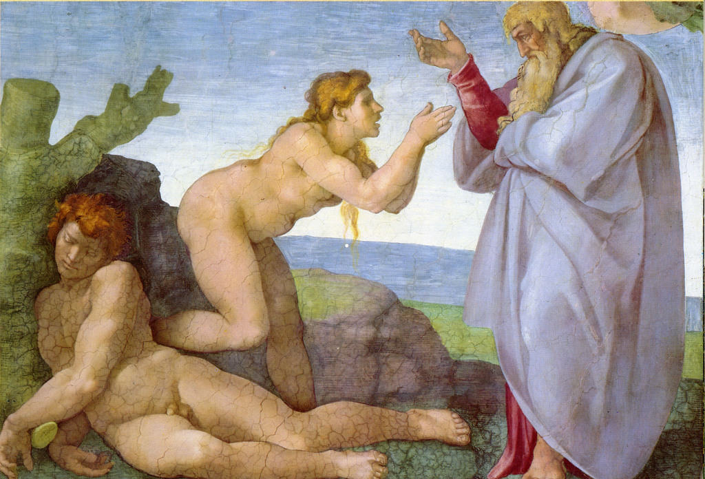

[🏠 Home](../../index.md)

# January 20

## 🧑‍🎨 Painting of the day

[Michelangelo](https://en.wikipedia.org/wiki/Michelangelo) (High Renaissance)

<button class="btn btn-success"
onclick=" window.open('https://lens.google.com/uploadbyurl?url=https://iretes.github.io/one-a-day/data/img/Michelangelo_6.jpg','_blank')">
Search with Google Lens
</button>

## 🎼 Song of the day

> *Let It Be*
by The Beatles

 Written by John Lennon, Paul McCartney.

Released in March, 1970.

<button class="btn btn-success"
onclick=" window.open('http://www.youtube.com/search?q=Let It Be by The Beatles','_blank')">
Search on YouTube
</button>

## 🏛️ UNESCO heritage site of the day

> *Buddhist Monuments at Sanchi*, India

On a hill overlooking the plain and about 40 km from Bhopal, the site of Sanchi comprises a group of Buddhist monuments (monolithic pillars, palaces, temples and monasteries) all in different states of conservation most of which date back to the 2nd and 1st centuries B.C. It is the oldest Buddhist sanctuary in existence and was a major Buddhist centre in India until the 12th century A.D.

<button class="btn btn-success"
onclick=" window.open('http://www.google.com/search?q=Buddhist Monuments at Sanchi','_blank')">
Search on Google
</button>

## 🗺️ Place of the day

<iframe
src="https://www.mapcrunch.com"
name="mapcrunch"
width="500"
height="500"
allowTransparency="true"
scrolling="no"
frameborder="0"
>
</iframe>
## 🎨 Color of the day

> *[Dark orange](https://en.wikipedia.org/wiki/Shades_of_orange#Dark_orange_(web_color))*

&#9632;

## 🌿 Plant of the day

> *poison ivy*

<button class="btn btn-success"
onclick=" window.open('http://www.google.com/search?q=poison ivy','_blank')">
Search on Google
</button>

## 🧑‍🔬 Scientific discovery of the day

> *1957: Chien Shiung Wu: demonstrated that parity, and thus charge conjugation and time-reversals, are violated for weak interactions*

<button class="btn btn-success"
onclick=" window.open('http://www.google.com/search?q=1957: Chien Shiung Wu: demonstrated that parity, and thus charge conjugation and time-reversals, are violated for weak interactions','_blank')">
Search on Google
</button>

## 💭 Philosophical concept of the day

> *[Inference](https://en.wikipedia.org/wiki/Inference)*

## 🗣️ Saying of the day

> *Iron hoof*

Poof
(homosexual).
