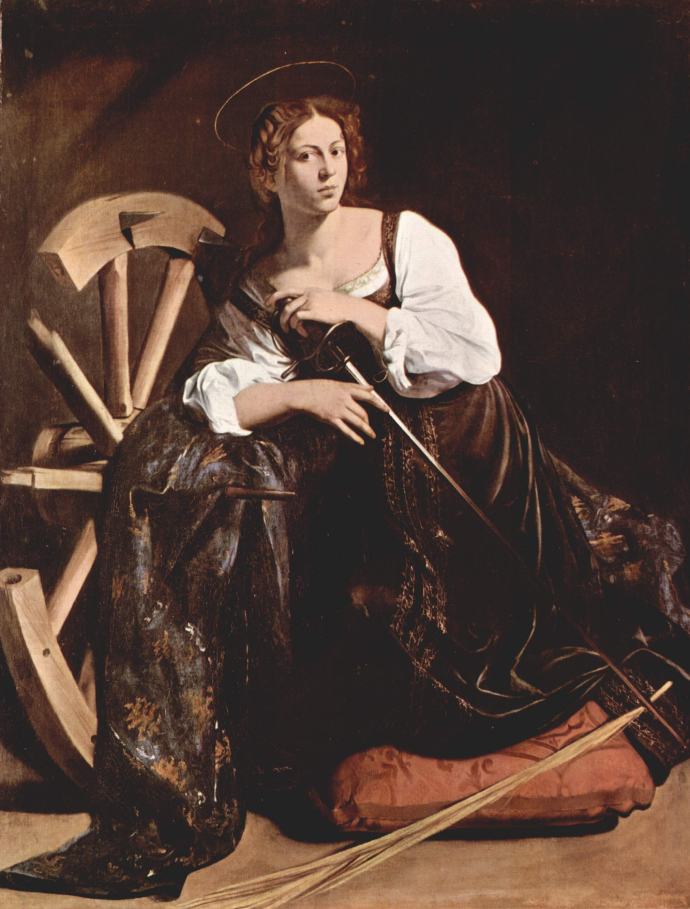

[🏠 Home](../../index.md)

# January 24

## 🧑‍🎨 Painting of the day

[Caravaggio](http://en.wikipedia.org/wiki/Caravaggio) (Baroque)

<button class="btn btn-success"
onclick=" window.open('https://lens.google.com/uploadbyurl?url=https://iretes.github.io/one-a-day/data/img/Caravaggio_7.jpg','_blank')">
Search with Google Lens
</button>

## 🎼 Song of the day

> *People Get Ready*
by The Impressions

 Written by Curtis Mayfield.

Released in Jan, 1965.

<button class="btn btn-success"
onclick=" window.open('http://www.youtube.com/search?q=People Get Ready by The Impressions','_blank')">
Search on YouTube
</button>

## 🏛️ UNESCO heritage site of the day

> *Noel Kempff Mercado National Park*, Bolivia (Plurinational State of)

The National Park is one of the largest (1,523,000 ha) and most intact parks in the Amazon Basin. With an altitudinal range of 200 m to nearly 1,000 m, it is the site of a rich mosaic of habitat types from Cerrado savannah and forest to upland evergreen Amazonian forests. The park boasts an evolutionary history dating back over a billion years to the Precambrian period. An estimated 4,000 species of flora as well as over 600 bird species and viable populations of many globally endangered or threatened vertebrate species live in the park.

<button class="btn btn-success"
onclick=" window.open('http://www.google.com/search?q=Noel Kempff Mercado National Park','_blank')">
Search on Google
</button>

## 🗺️ Place of the day

<iframe
src="https://www.mapcrunch.com"
name="mapcrunch"
width="500"
height="500"
allowTransparency="true"
scrolling="no"
frameborder="0"
>
</iframe>
## 🎨 Color of the day

> *[Deep pink](https://en.wikipedia.org/wiki/Shades_of_pink#Deep_pink)*

&#9632;

## 🌿 Plant of the day

> *white alder*

<button class="btn btn-success"
onclick=" window.open('http://www.google.com/search?q=white alder','_blank')">
Search on Google
</button>

## 🧑‍🔬 Scientific discovery of the day

> *1877: Ludwig Boltzmann: Statistical definition of entropy.*

<button class="btn btn-success"
onclick=" window.open('http://www.google.com/search?q=1877: Ludwig Boltzmann: Statistical definition of entropy.','_blank')">
Search on Google
</button>

## 💭 Philosophical concept of the day

> *[Autonomy](https://en.wikipedia.org/wiki/Autonomy)*

## 🗣️ Saying of the day

> *Verbosity leads to unclear, inarticulate things*

Quotation - widely attributed to US ex Vice-President Dan Quayle. 

## 🏳️‍🌈 International day

International Day of Education.