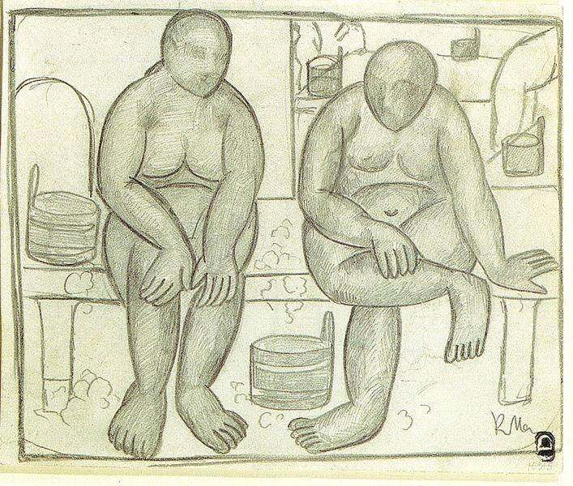

[🏠 Home](../../index.md)

# January 25

## 🧑‍🎨 Painting of the day

[Kazimir Malevich](http://en.wikipedia.org/wiki/Kazimir_Malevich) (Suprematism)

<button class="btn btn-success"
onclick=" window.open('https://lens.google.com/uploadbyurl?url=https://iretes.github.io/one-a-day/data/img/Kazimir_Malevich_2.jpg','_blank')">
Search with Google Lens
</button>

## 🎼 Song of the day

> *God Only Knows*
by The Beach Boys

 Written by Brian Wilson, Tony Asher.

Released in May, 1966.

<button class="btn btn-success"
onclick=" window.open('http://www.youtube.com/search?q=God Only Knows by The Beach Boys','_blank')">
Search on YouTube
</button>

## 🏛️ UNESCO heritage site of the day

> *Wooden <em>Tserkvas</em> of the Carpathian Region in Poland and Ukraine*, Poland,Ukraine

Situated in the eastern fringe of Central Europe, the transnational property numbers a selection of sixteen&nbsp;<em>tserkvas&nbsp;</em>(churches). They were built of horizontal wooden logs between the 16th&nbsp;and 19th&nbsp;centuries by communities of Orthodox and Greek Catholic faiths. The&nbsp;<em>tserkvas</em>&nbsp;bear testimony to a distinct building tradition rooted in Orthodox ecclesiastic design interwoven with elements of local tradition, and symbolic references to their communities&rsquo; cosmogony.&nbsp;&nbsp;The&nbsp;<em>tserkva</em><em>s&nbsp;</em>are built on a tri-partite plan surmounted by open quadrilateral or octagonal domes and cupolas. Integral to <em>tserkvas</em> are iconostasis screens, interior polychrome decorations, and other historic furnishings. Important elements of some <em>tserkvas</em> include&nbsp;wooden bell towers, churchyards, gatehouses and graveyards.

<button class="btn btn-success"
onclick=" window.open('http://www.google.com/search?q=Wooden <em>Tserkvas</em> of the Carpathian Region in Poland and Ukraine','_blank')">
Search on Google
</button>

## 🗺️ Place of the day

<iframe
src="https://www.mapcrunch.com"
name="mapcrunch"
width="500"
height="500"
allowTransparency="true"
scrolling="no"
frameborder="0"
>
</iframe>
## 🎨 Color of the day

> *[Queen blue](https://en.wikipedia.org/wiki/Royal_blue#Queen_blue)*

&#9632;

## 🌿 Plant of the day

> *amy root*

<button class="btn btn-success"
onclick=" window.open('http://www.google.com/search?q=amy root','_blank')">
Search on Google
</button>

## 🧑‍🔬 Scientific discovery of the day

> *1800 BC - 1600 BC: A numerical approximation for the square root of two, accurate to 6 decimal places, is recorded on YBC 7289, a Babylonian clay tablet believed to belong to a student.*

<button class="btn btn-success"
onclick=" window.open('http://www.google.com/search?q=1800 BC - 1600 BC: A numerical approximation for the square root of two, accurate to 6 decimal places, is recorded on YBC 7289, a Babylonian clay tablet believed to belong to a student.','_blank')"> 
Search on Google
</button>

## 💭 Philosophical concept of the day

> *[Daimonic](https://en.wikipedia.org/wiki/Daimonic)*

## 🗣️ Saying of the day

> *Grandfather clock*

A   grandfather clock is a colloquial name for the kind of weight-and-pendulum eight-day clock in a tall case, formerly in common use.
