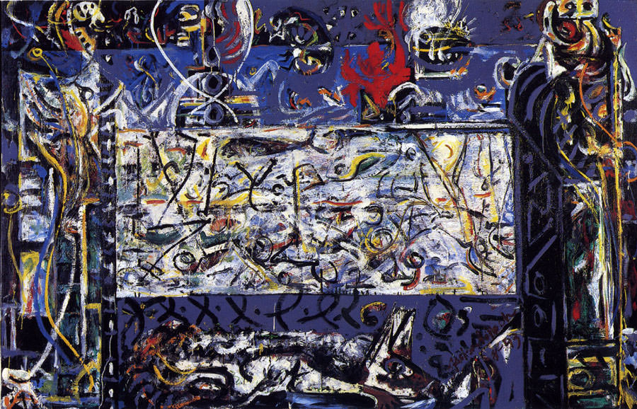

[🏠 Home](../../index.md)

# January 26

## 🧑‍🎨 Painting of the day

[Jackson Pollock](http://en.wikipedia.org/wiki/Jackson_Pollock) (Abstract Expressionism)

<button class="btn btn-success"
onclick=" window.open('https://lens.google.com/uploadbyurl?url=https://iretes.github.io/one-a-day/data/img/Jackson_Pollock_7.jpg','_blank')">
Search with Google Lens
</button>

## 🎼 Song of the day

> *(Sittin' on) the Dock of the Bay*
by Otis Redding

 Written by Redding, Steve Cropper.

Released in Jan, 1968.

<button class="btn btn-success"
onclick=" window.open('http://www.youtube.com/search?q=(Sittin  on) the Dock of the Bay by Otis Redding','_blank')">
Search on YouTube
</button>

## 🏛️ UNESCO heritage site of the day

> *Sudanese style mosques in northern Côte d’Ivoire*, Côte d'Ivoire

The eight small adobe mosques, at Tengréla, Kouto, Sorobango, Samatiguila, M’Bengué, Kong and Kaouara are characterized by protruding timbers, vertical buttresses crowned by pottery or ostrich eggs, and tapering minarets. They present an interpretation of an architectural style thought to have originated around the 14th century in the town of Djenné, then part of the Empire of Mali, which prospered from the trade in gold and salt across the Sahara to North Africa. Particularly from the 16th century, the style spread south from the desert regions into the Sudanese savannah, becoming lower and developing stouter buttresses in response to the wetter climate. The mosques are the best conserved of 20 such edifices that remain in Côte d’Ivoire, where hundreds existed early last century. The mosques’ distinctive Sudanese style, specific to the savannah region of West Africa, developed between the 17th and 19th centuries as traders and scholars spread south from the Empire of Mali, extending the trans-Saharan mercantile routes into the forest area. They present highly important testimonies to the trans-Saharan trade that facilitated the expansion of Islam and Islamic culture and reflect a fusion of Islamic and local architectural forms in a highly distinctive style that has persisted over time. 

<button class="btn btn-success"
onclick=" window.open('http://www.google.com/search?q=Sudanese style mosques in northern Côte d’Ivoire','_blank')">
Search on Google
</button>

## 🗺️ Place of the day

<iframe
src="https://www.mapcrunch.com"
name="mapcrunch"
width="500"
height="500"
allowTransparency="true"
scrolling="no"
frameborder="0"
>
</iframe>
## 🎨 Color of the day

> *[Sacramento State green](https://en.wikipedia.org/wiki/Shades_of_green#Sacramento_State_green)*

&#9632;

## 🌿 Plant of the day

> *silkweed*

<button class="btn btn-success"
onclick=" window.open('http://www.google.com/search?q=silkweed','_blank')">
Search on Google
</button>

## 🧑‍🔬 Scientific discovery of the day

> *1963: Lawrence Morley, Fred Vine, and Drummond Matthews: Paleomagnetic stripes in ocean crust as evidence of plate tectonics (Vine–Matthews–Morley hypothesis).*

<button class="btn btn-success"
onclick=" window.open('http://www.google.com/search?q=1963: Lawrence Morley, Fred Vine, and Drummond Matthews: Paleomagnetic stripes in ocean crust as evidence of plate tectonics (Vine–Matthews–Morley hypothesis).','_blank')"> 
Search on Google
</button>

## 💭 Philosophical concept of the day

> *[Transworld identity](https://en.wikipedia.org/wiki/Transworld_identity)*

## 🗣️ Saying of the day

> *Cat may look at a king - A *

An inferior isn't completely restricted in what they may do in the presence of a superior. 

## 🏳️‍🌈 International day

International Day of Clean Energy.