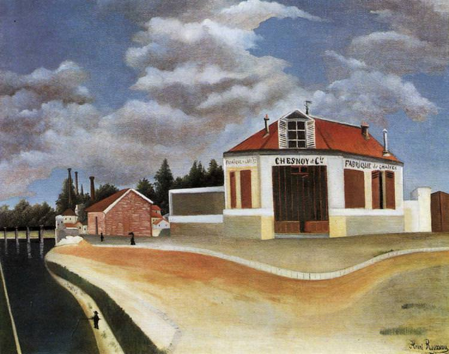

[🏠 Home](../../index.md)

# January 27

## 🧑‍🎨 Painting of the day

[Henri Rousseau](https://en.wikipedia.org/wiki/Henri_Rousseau) (Primitivism)

<button class="btn btn-success"
onclick=" window.open('https://lens.google.com/uploadbyurl?url=https://iretes.github.io/one-a-day/data/img/Henri_Rousseau_8.jpg','_blank')">
Search with Google Lens
</button>

## 🎼 Song of the day

> *Layla*
by Derek and the Dominos

 Written by Eric Clapton, Jim Gordon.

Released in Nov, 1970.

<button class="btn btn-success"
onclick=" window.open('http://www.youtube.com/search?q=Layla by Derek and the Dominos','_blank')">
Search on YouTube
</button>

## 🏛️ UNESCO heritage site of the day

> *Mathildenhöhe Darmstadt*, Germany

The Darmstadt Artists’ Colony on Mathildenhöhe, the highest elevation above the city of Darmstadt in west-central Germany, was established in 1897 by Ernst Ludwig, Grand Duke of Hesse, as a centre for emerging reform movements in architecture, arts and crafts. The buildings of the colony were created by its artist members as experimental early modernist living and working environments. The colony was expanded during successive international exhibitions in 1901, 1904, 1908 and 1914. Today, it offers a testimony to early modern architecture, urban planning and landscape design, all of which were influenced by the Arts and Crafts movement and the Vienna Secession. The serial property consists of two component parts including 23 elements, such as the Wedding Tower (1908), the Exhibition Hall (1908), the Plane Tree Grove (1833, 1904-14), the Russian Chapel of St. Maria Magdalena (1897-99), the Lily Basin, the Gottfried Schwab Memorial (1905), the Pergola and Garden (1914), the “Swan Temple” Garden Pavilion (1914), the Ernst Ludwig Fountain, and the 13 houses and artists’ studios that were built for the Darmstadt Artists’ Colony and for the international exhibitions. A Three House Group, built for the 1904 exhibition is an additional component.

<button class="btn btn-success"
onclick=" window.open('http://www.google.com/search?q=Mathildenhöhe Darmstadt','_blank')">
Search on Google
</button>

## 🗺️ Place of the day

<iframe
src="https://www.mapcrunch.com"
name="mapcrunch"
width="500"
height="500"
allowTransparency="true"
scrolling="no"
frameborder="0"
>
</iframe>
## 🎨 Color of the day

> *[Inchworm](https://en.wikipedia.org/wiki/List_of_Crayola_crayon_colors#Standard_colors)*

&#9632;

## 🌿 Plant of the day

> *trillium*

<button class="btn btn-success"
onclick=" window.open('http://www.google.com/search?q=trillium','_blank')">
Search on Google
</button>

## 🧑‍🔬 Scientific discovery of the day

> *1500: Nilakantha Somayaji develops a model similar to the Tychonic system. His model has been described as mathematically more efficient than the Tychonic system due to correctly considering the equation of the centre and latitudinal motion of Mercury and Venus.*

<button class="btn btn-success"
onclick=" window.open('http://www.google.com/search?q=1500: Nilakantha Somayaji develops a model similar to the Tychonic system. His model has been described as mathematically more efficient than the Tychonic system due to correctly considering the equation of the centre and latitudinal motion of Mercury and Venus.','_blank')"> 
Search on Google
</button>

## 💭 Philosophical concept of the day

> *[De dicto and de re](https://en.wikipedia.org/wiki/De_dicto_and_de_re)*

## 🗣️ Saying of the day

> *We are not amused*

'We are not amused' is a quotation, attributed to Queen Victoria.

## 🏳️‍🌈 International day

International Day of Commemoration in Memory of the Victims of the Holocaust.